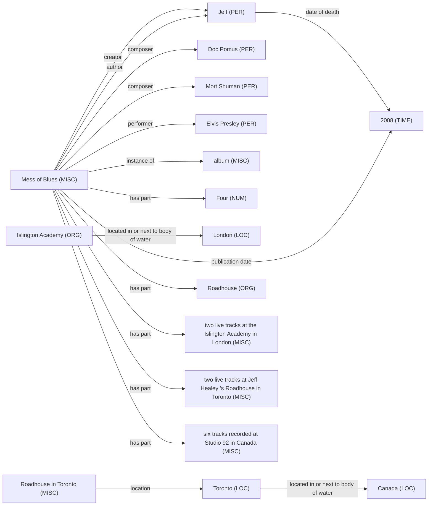
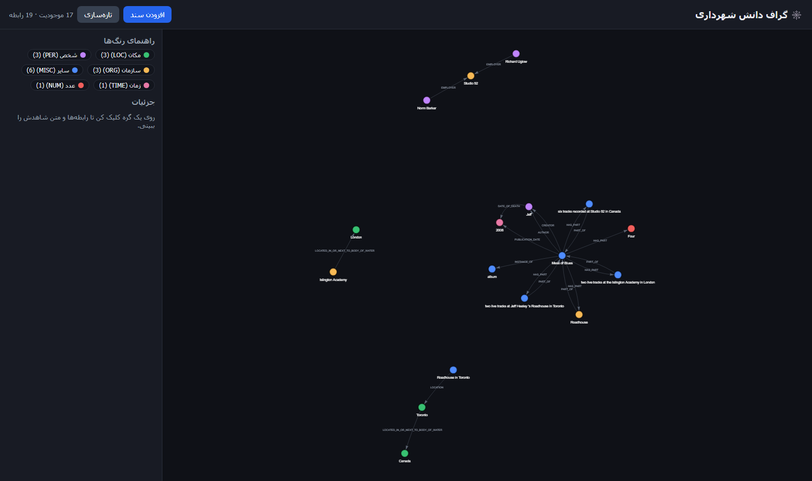
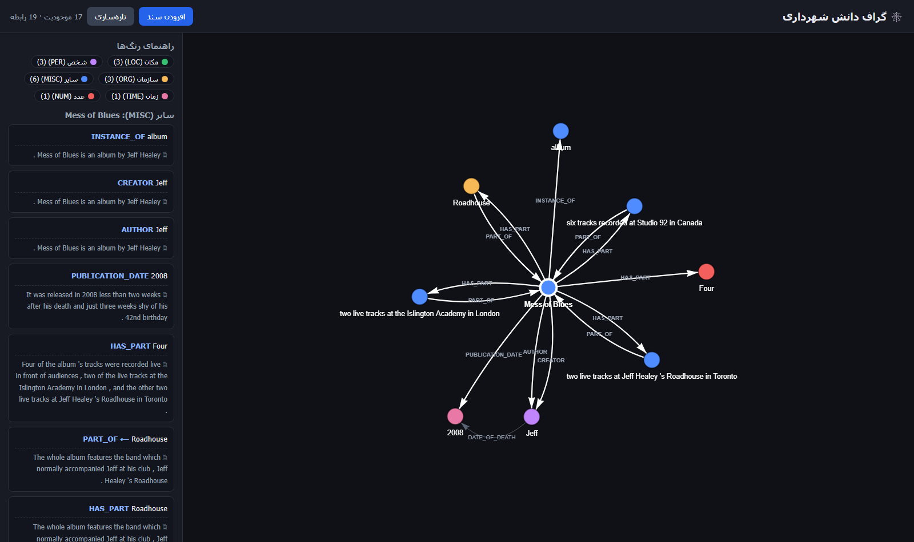
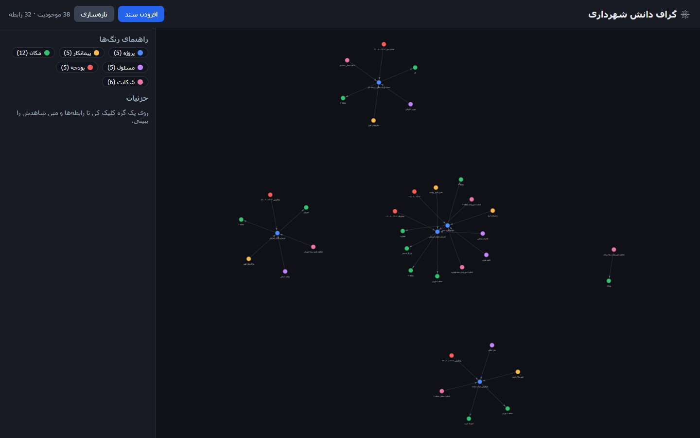
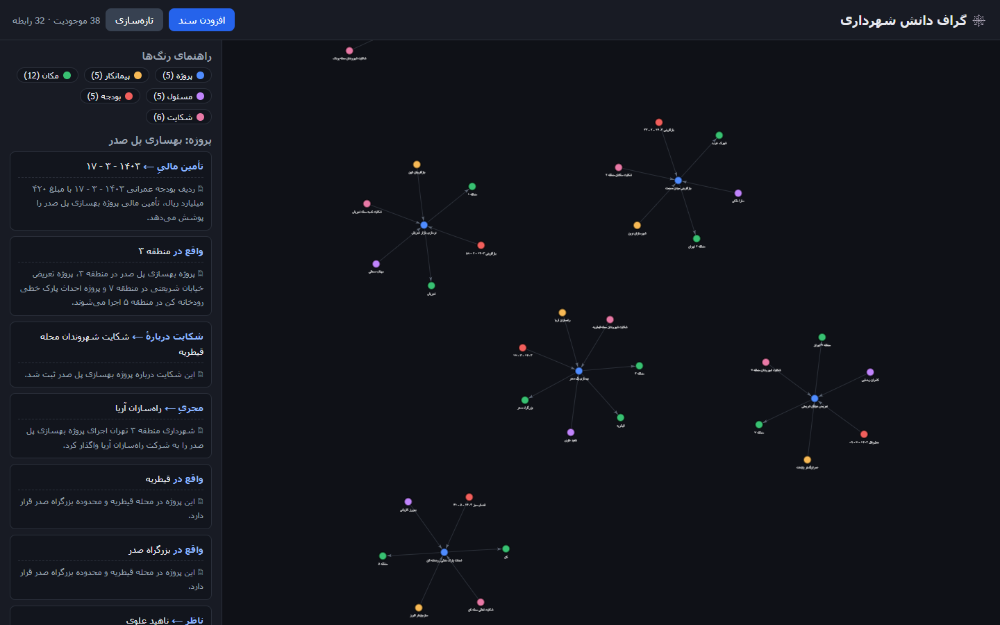

# ساخت خودکار گراف دانش از متن غیرساختاریافته با مدل‌های زبانی و هستان‌شناسی مقیّد

**نویسنده:** مصطفی رستگار
**دیتاست اصلی:** Re-DocRED (انگلیسی، ۴٬۰۵۳ سند، ۱۲۰٬۶۶۴ سه‌تایی طلایی)
**مطالعه‌ی موردی (فصل آخر):** اسناد شهرداری تهران (فارسی)

---

## چکیده

در این پروژه سامانه‌ای ساخته‌ایم که از متن آزاد سه‌تایی‌های `(موجودیت، رابطه، موجودیت)` بیرون می‌کشد و آن‌ها را در یک گراف دانش قابل پرس‌وجو می‌نشاند. آنچه سامانه را از یک فراخوانی ساده‌ی مدل زبانی جدا می‌کند سه تصمیم است: هستان‌شناسی مقیّد که خروجی نامعتبر را رد می‌کند، الزام شاهد که هر یال را به جمله‌ی منبعش می‌بندد، و خط لوله‌ای که اجرای دوباره‌اش داده‌ی تکراری نمی‌سازد.

سامانه روی بنچمارک استاندارد Re-DocRED ارزیابی شد. در شش تکرار، F1 از ۱۶٫۸۸ به **۲۹٫۶۶** رسید (۷۶٪ رشد نسبی)، در حالی که خط‌مبنای منتشرشده با GPT-3.5 روی همین دیتاست ۹٫۷۴ است. هیچ مرحله‌ی آموزش گرادیانی انجام نشد، ولی سامانه **بدون نظارت نیست**: هستان‌شناسی و مثال‌های پرامپت هر دو از بخش Train مشتق شده‌اند (بخش ۶٫۴). سه عامل این رشد را ساختند: مثال کاری در پرامپت که دقت را ۲۴٪ بالا برد، لایه‌ی بستار قاعده‌محور، و اجماع چند گذر مستقل.

سپس سامانه روی **کل ۵۰۰ سند بخش Dev** اجرا شد و **F1 = ۲۸٫۶۴** گرفت. اختلاف با عدد زیرمجموعه کمتر از یک واحد است، پس نتیجه به یک نمونه‌ی کوچک وابسته نیست. در پایان همان مدل بدون تغییر معماری روی اسناد فارسی شهرداری اجرا شد و به‌عنوان مطالعه‌ی موردی ایرانی گزارش شد.

---

## ۱. مقدمه

بخش بزرگی از دانش هر سازمانی جایی ذخیره نشده که بشود از آن پرس‌وجو گرفت؛ در متن آزاد پراکنده است. برای پاسخ به پرسشی به‌ظاهر ساده — مثلاً اینکه مجری فلان پروژه چه شرکتی بوده، یا فلان شخص تابع کدام کشور است — باید ده‌ها سند را دستی خواند و کنار هم گذاشت.

گراف دانش راه‌حل شناخته‌شده‌ی این وضعیت است: متن به گره و یال تبدیل می‌شود و پرسش، به‌جای خواندن، با یک پرس‌وجو پاسخ می‌گیرد.

آنچه در این پروژه دنبال کردیم، استخراج رابطه در سطح سند (Document-level Relation Extraction) است. ورودی یک متن چندجمله‌ای است و خروجی مجموعه‌ای از سه‌تایی‌ها که هرکدام به جمله‌ی منبع خود گره خورده‌اند. دو چیز کار را سخت می‌کند.

نخست اینکه رابطه معمولاً در یک جمله جمع نشده است؛ مدل باید چند جمله را دنبال کند و از زنجیره‌ی هم‌مرجعی رد شود. دوم، و مهم‌تر، اینکه مدل زبانی رابطه‌ی نادرست می‌سازد. برای یک گراف دانش این خطا از خطای معمول بدتر است، چون یک یال غلط یک‌بار وارد می‌شود و بعد برای همیشه در پایگاه‌داده می‌ماند و به پرسش‌های بعدی هم سرایت می‌کند.

---

## ۲. کار پیشین

| رویکرد | نقطه‌ی قوت | نقطه‌ی ضعف |
|---|---|---|
| استخراج قاعده‌محور (Rule-based / OpenIE) | شفاف و بدون نیاز به داده | الگوی دستی، شکننده، پوشش کم، برای فارسی ضعیف |
| مدل‌های نظارت‌شده‌ی RE (ATLOP، KD-DocRE، GLiDRE) | دقت بالا روی بنچمارک | نیازمند هزاران سند برچسب‌خورده که در دامنه‌ی فارسی وجود ندارد |
| استخراج با مدل زبانی بزرگ (zero-shot) | بدون داده‌ی آموزشی کار می‌کند | مستعد تولید رابطه‌ی نادرست و خارج از دامنه |
| پایگاه‌داده‌ی گرافی (Neo4j) | بستر استاندارد ذخیره و پرس‌وجو | خودش استخراج نمی‌کند |

کار حاضر در دسته‌ی سوم است، ولی خطای آن را با یک لایه‌ی نمادین (symbolic) مهار می‌کند. این ترکیب در ادبیات **Neuro-symbolic Knowledge Graph Construction** نامیده می‌شود.

---

## ۳. نوآوری کار

ایده‌ی محوری این است که به مدل زبانی اعتماد نکنیم و خروجی‌اش را از چند صافی رد کنیم. پنج جزء زیر روی هم این کار را انجام می‌دهند.

**۳.۱ هستان‌شناسی مقیّد.** سه‌تایی تنها وقتی پذیرفته می‌شود که ترکیب `(نوع فاعل، رابطه، نوع مفعول)` آن در فهرست مجاز باشد؛ هر چیز دیگری بی‌چون‌وچرا کنار گذاشته می‌شود. این صافی در اجرای روی Re-DocRED یک‌پنجم خروجی مدل (۲۰٫۳٪) را رد کرد، و همان‌طور که در بخش ۶٫۴ نشان می‌دهیم، بهایی که بابتش پرداختیم تنها ۰٫۲۱٪ از بازخوانی بود.

**۳.۲ شاهد اجباری.** هر یال باید عین جمله‌ی منبع را با خود حمل کند و یال بی‌شاهد اصلاً وارد گراف نمی‌شود. حاصلش این است که هیچ ادعایی در گراف نمی‌ماند که نشود آن را تا متن اصلی دنبال کرد.

**۳.۳ لایه‌ی بستار قاعده‌محور.** مدل زبانی آنچه را می‌گوید که در جمله نوشته شده؛ اما گراف دانش باید آنچه را هم نگه دارد که از خودِ گراف نتیجه می‌شود. سه قاعده روی گراف اجرا می‌شوند و حقیقت‌های تازه می‌سازند. نکته‌ی طراحی اینجاست که هر حقیقت استنتاجی شاهد مقدمه‌هایش را به ارث می‌برد، پس قانون بند قبل زیر پا گذاشته نمی‌شود.

**۳.۴ خط لوله‌ی idempotent.** سند تازه اضافه کنید و دوباره اجرا کنید؛ نه سند تکراری ساخته می‌شود، نه قطعه، نه سه‌تایی، نه گره و نه یال. این را با کلید پایدار `entity_key` برای گره‌ها، `fact_id` مبتنی بر sha1 برای یال‌ها و کش در سطح `chunk_sha` به دست آوردیم.

**۳.۵ ورودی چندقالبی.** علاوه بر PDF و DOCX و TXT، تصویر (PNG/JPG) هم پذیرفته می‌شود و با مدل vision رونویسی می‌گردد.

---

## ۴. متدلوژی

### ۴.۱ معماری سه‌مرحله‌ای

| مرحله | ورودی ← خروجی | کار |
|---|---|---|
| **۱) ورود و پاک‌سازی** | سند خام ← قطعه‌ی متنی | استخراج متن، نرمال‌سازی (hazm برای فارسی)، قطعه‌بندی، ثبت `chunk_sha` |
| **۲) استخراج دانش** | قطعه ← سه‌تایی | فراخوانی مدل زبانی، اعتبارسنجی Pydantic، رد موارد خارج از هستان‌شناسی، الزام شاهد، حذف تکراری با `fact_id` |
| **۳) بستار و بارگذاری** | سه‌تایی ← گراف | اجرای سه قاعده‌ی استنتاج، سپس `MERGE` گره و یال در Neo4j |

### ۴.۲ هستان‌شناسی

هستان‌شناسی از سامانه **جدا** است و از فایل JSON خوانده می‌شود (فلگ `--ontology`). این تصمیم طراحی باعث شد همان کد بدون بازنویسی روی دو دیتاست کاملاً متفاوت کار کند:

| دیتاست | منبع هستان‌شناسی | نوع موجودیت | رابطه | ترکیب مجاز |
|---|---|---:|---:|---:|
| شهرداری (فارسی) | دست‌نویس | ۶ | ۵ | ۵ |
| Re-DocRED (انگلیسی) | **خودکار از بخش Train** | ۶ | ۹۶ | **۶۵۴** |

برای Re-DocRED هیچ قاعده‌ای دست‌نویس نشد. ۶۵۴ ترکیب مجاز از روی داده‌ی آموزشی محاسبه شد.

### ۴.۳ لایه‌ی بستار قاعده‌محور

| قاعده | منطق |
|---|---|
| **R1 معکوس** | `A در B واقع است` ⟹ `B شامل A است` |
| **R2 تراگذری** | `A در B` و `B در C` ⟹ `A در C` |
| **R3 زنجیره** | `A در B` و `B کشورش C` ⟹ `A کشورش C` |

### ۴.۴ پشته‌ی فناوری

Python، PyMuPDF و python-docx، hazm، مدل `openai/gpt-4.1-mini` با دمای ۰، Pydantic برای اعتبارسنجی، tenacity برای تلاش دوباره، Neo4j 5 روی Docker، و FastAPI به‌همراه vis-network برای رابط وب.

---

## ۵. دیتاست اصلی — Re-DocRED

**منبع:** https://github.com/tonytan48/Re-DocRED · **لایسنس:** MIT
**مقاله‌ی پایه:** Yao et al., *DocRED*, ACL 2019
**مقاله‌ی نسخه‌ی اصلاح‌شده:** Tan et al., *Revisiting DocRED — Addressing the False Negative Problem*, EMNLP 2022

نسخه‌ی اصلاح‌شده انتخاب شد، چون DocRED اصلی تعداد زیادی **منفی کاذب** دارد: رابطه‌ای که در متن هست ولی برچسب نخورده. Re-DocRED آن‌ها را با بازبینی انسانی ترمیم کرد.

### ۵.۱ جدول ۱ — ابعاد کلی

اعداد از روی فایل‌های واقعی محاسبه شد، نه از مقاله نقل شد.

| بخش | سند | جمله | توکن | موجودیت | ذکر (mention) | سه‌تایی |
|---|---:|---:|---:|---:|---:|---:|
| Train | ۳٬۰۵۳ | ۲۴٬۲۵۶ | ۶۰۳٬۴۶۸ | ۵۹٬۳۵۹ | ۷۹٬۴۸۱ | ۸۵٬۹۳۲ |
| Dev | ۵۰۰ | ۴٬۱۱۰ | ۱۰۱٬۹۷۰ | ۹٬۶۸۴ | ۱۳٬۱۸۹ | ۱۷٬۲۸۴ |
| Test | ۵۰۰ | ۳٬۹۶۶ | ۹۸٬۷۳۴ | ۹٬۷۷۹ | ۱۳٬۰۱۸ | ۱۷٬۴۴۸ |
| **جمع** | **۴٬۰۵۳** | **۳۲٬۳۳۲** | **۸۰۴٬۱۷۲** | **۷۸٬۸۲۲** | **۱۰۵٬۶۸۸** | **۱۲۰٬۶۶۴** |

| شاخص | مقدار |
|---|---:|
| نوع رابطه | ۹۶ |
| نوع موجودیت | ۶ |
| میانگین جمله در هر سند | ۸٫۰ |
| میانگین توکن در هر سند | ۱۹۸٫۴ |
| میانگین موجودیت در هر سند | ۱۹٫۴ |
| میانگین سه‌تایی در هر سند | ۲۹٫۸ |
| حجم خام | ۲۴ مگابایت JSON |

### ۵.۲ جدول ۲ — توزیع نوع موجودیت

| نوع | معنی | تعداد | سهم |
|---|---|---:|---:|
| LOC | مکان | ۲۳٬۱۷۴ | ۲۹٫۴٪ |
| TIME | زمان | ۱۵٬۱۴۰ | ۱۹٫۲٪ |
| MISC | سایر | ۱۲٬۴۵۹ | ۱۵٫۸٪ |
| PER | شخص | ۱۲٬۲۷۷ | ۱۵٫۶٪ |
| ORG | سازمان | ۱۰٬۷۳۵ | ۱۳٫۶٪ |
| NUM | عدد | ۵٬۰۳۷ | ۶٫۴٪ |
| **جمع** | | **۷۸٬۸۲۲** | **۱۰۰٪** |

### ۵.۳ جدول ۳ — ده رابطه‌ی پرتکرار (از ۹۶)

| رتبه | شناسه‌ی Wikidata | معنی | تعداد |
|---:|---|---|---:|
| ۱ | P131 | واقع در واحد تقسیمات کشوری | ۲۸٬۲۹۶ |
| ۲ | P17 | کشور | ۱۹٬۹۰۶ |
| ۳ | P27 | تابعیت | ۶٬۲۶۹ |
| ۴ | P150 | شامل واحد تقسیمات کشوری | ۴٬۷۶۴ |
| ۵ | P800 | اثر شاخص | ۴٬۲۵۷ |
| ۶ | P527 | دارای جزء | ۳٬۳۰۷ |
| ۷ | P361 | جزئی از | ۳٬۰۱۲ |
| ۸ | P175 | اجراکننده | ۲٬۳۸۶ |
| ۹ | P577 | تاریخ انتشار | ۲٬۲۵۸ |
| ۱۰ | P463 | عضو | ۱٬۸۷۷ |

### ۵.۴ جدول ۴ — ویژگی‌های هر رکورد (Schema)

| فیلد | سطح | نوع | توضیح |
|---|---|---|---|
| `title` | سند | متن | عنوان سند |
| `sents` | سند | آرایه‌ی آرایه | جمله‌های توکن‌شده |
| `vertexSet` | سند | آرایه | فهرست موجودیت‌ها |
| `vertexSet[i][j].name` | ذکر | متن | شکل ظاهری در متن |
| `vertexSet[i][j].type` | ذکر | برچسب | یکی از ۶ نوع |
| `vertexSet[i][j].sent_id` | ذکر | عدد | شماره‌ی جمله |
| `vertexSet[i][j].pos` | ذکر | بازه | موقعیت توکنی |
| `labels[k].h` | رابطه | اندیس | موجودیت مبدأ |
| `labels[k].t` | رابطه | اندیس | موجودیت مقصد |
| `labels[k].r` | رابطه | برچسب | یکی از ۹۶ رابطه |
| `labels[k].evidence` | رابطه | آرایه | شماره‌ی جمله‌های شاهد |

**تعداد ویژگی متمایز: ۱۱** — ۳ در سطح سند، ۴ در سطح ذکر، ۴ در سطح رابطه.

### ۵.۵ چرا این دیتاست چالشی است

**۵.۵.۱ استدلال چندجمله‌ای اجباری.**
۶۴٬۵۲۴ سه‌تایی — یعنی ۵۳٫۵٪ کل رابطه‌ها — میان دو موجودیتی برقرار است که هرگز در یک جمله کنار هم نمی‌آیند. عملاً یعنی هر مدل جمله‌محوری روی بیش از نیمی از این داده صفر می‌گیرد، هرچقدر هم در سطح جمله خوب کار کند.

**۵.۵.۲ نامتوازنی شدید کلاس.**
تعداد جفت‌موجودیت نامزد ۱٬۵۸۴٬۹۹۴ است، ولی فقط ۱۲۰٬۶۶۴ جفت رابطه دارند. **نرخ مثبت ۷٫۶۱٪** است. مدل باید ۹۲٫۴٪ موارد را درست رد کند. این دقیقاً همان مسئله‌ی مهار توهم است.

**۵.۵.۳ فضای برچسب بزرگ و دنباله‌دار.**
۹۶ رابطه وجود دارد، ولی ۵ رابطه‌ی نخست ۵۲٫۶٪ نمونه‌ها را می‌گیرند و ۷ رابطه کمتر از ۱۰۰ نمونه دارند.

**۵.۵.۴ چندبرچسبی بودن.**
**۲۴٬۶۳۶ جفت‌موجودیت بیش از یک رابطه‌ی هم‌زمان دارند.** پس ارزیابی باید چندبرچسبی باشد.

**۵.۵.۵ هم‌مرجعی و حل موجودیت.**
۱۰۵٬۶۸۸ ذکر به ۷۸٬۸۲۲ موجودیت نگاشت می‌شود و ۱۸٫۶٪ موجودیت‌ها بیش از یک ذکر دارند. «Willi Schneider» و «Schneider» باید به یک گره برسند.

**۵.۵.۶ مقیاس محاسباتی.**
۸۰۴٬۱۷۲ توکن و ۱٫۵۸ میلیون جفت نامزد یعنی خط لوله باید دسته‌ای، قابل ازسرگیری و بدون تکرار کار باشد.

### ۵.۶ گزینه‌های فارسی که بررسی و رد شد

| دیتاست | اندازه | چرا انتخاب نشد |
|---|---|---|
| PERLEX | ۱۰٬۶۹۰ جمله، ۹ رابطه | سطح جمله است، نه سطح سند. استدلال چندجمله‌ای ندارد. |
| FarsBase-KBP | ۲۲٬۰۱۵ سه‌تایی فارسی | فایل داده به‌صورت عمومی در دسترس نیست. نیاز به مکاتبه با نویسندگان دارد. |
| ARMAN / PEYMA | فقط NER | رابطه ندارد، پس برای گراف دانش ناقص است. |

---

## ۶. آرایش آزمایش و معیارها

### ۶.۱ آرایش

آرایش استاندارد این بنچمارک رعایت شد: **فهرست موجودیت‌های هر سند به مدل داده می‌شود** و مدل باید رابطه‌های بین آن‌ها را پیدا کند و برای هر رابطه جمله‌ی شاهد را نقل کند.

| بخش سامانه | تغییر برای Re-DocRED |
|---|---|
| قطعه‌بندی و پیش‌پردازش | بدون تغییر |
| فراخوانی مدل زبانی | بدون تغییر |
| اعتبارسنجی Pydantic | بدون تغییر |
| شاهد اجباری | بدون تغییر |
| حذف تکراری با `fact_id` | بدون تغییر |
| **هستان‌شناسی** | **از فایل JSON خوانده می‌شود** |

### ۶.۲ معیارها

- **Precision / Recall / F1** روی مجموعه‌ی سه‌تایی‌های `(سند، موجودیت مبدأ، رابطه، موجودیت مقصد)`.
- **Ign F1** معیار سخت‌گیرانه‌ی DocRED. هر حقیقتی که در بخش Train هم دیده شده، از **هر دو طرف** (طلایی و پیش‌بینی) حذف می‌شود، تا حفظ‌کردن جواب امتیاز نگیرد.

### ۶.۳ اعتبارسنجی خودِ ارزیاب

پیش از باور کردن هر عددی، خود ارزیاب آزمایش شد. شش تست آفلاین (بدون شبکه و بدون مدل زبانی) اجرا می‌شود:

| تست | چه چیزی را ثابت می‌کند |
|---|---|
| اوراکل | پاسخ کامل درست باید ~۱۰۰ بگیرد |
| نصف بازخوانی | نصف پاسخ باید دقت ۱۰۰ و بازخوانی ~۵۰ بگیرد |
| موجودیت ناشناخته | نام نامعتبر باید حذف شود، نه اینکه امتیاز بگیرد |
| شکل ظاهری متفاوت | ذکر دیگرِ همان موجودیت باید به همان گره برسد |
| مجموعه‌ی Ign | مجموعه‌ی Ign باید کوچک‌تر از مجموعه‌ی کامل باشد |
| قاعده‌های بستار | R1، R2 و R3 باید فعال شوند و هر حقیقت استنتاجی شاهد داشته باشد |

**سقف نظری روش:** پاسخ اوراکل F1 = **۹۹٫۶۲** روی زیرمجموعه‌ی ۵۰ سند و **۹۹٫۷۶** روی کل ۵۰۰ سند Dev گرفت، نه ۱۰۰. علت: در چند سند دو موجودیت متفاوت با **نام و نوع یکسان** وجود دارد و با نام قابل تفکیک نیستند. پس سقف هر سامانه‌ی نام‌محور روی این داده حدود ۹۹٫۷ است و عدد مدل باید کنار این سقف خوانده شود.

### ۶.۴ سامانه دقیقاً از چه نظارتی استفاده می‌کند

این بخش برای جلوگیری از یک ادعای اغراق‌آمیز نوشته شده است. سامانه **هیچ مرحله‌ی آموزش گرادیانی ندارد**؛ هیچ وزنی به‌روز نمی‌شود. ولی «بدون نظارت» هم نیست. دو چیز از بخش **Train** گرفته شده است:

| چه چیزی از Train آمده | چگونه استفاده می‌شود | کدام نسخه‌ها |
|---|---|---|
| هستان‌شناسی: ۶۵۴ ترکیب مجاز `(نوع، رابطه، نوع)` | هر سه‌تایی بیرون این فهرست رد می‌شود | v1 تا v6 |
| دو سند نمونه با پاسخ کامل طلایی | داخل پرامپت به‌عنوان مثال کاری | v4 تا v6 |

**پیامد مهم:** چون هستان‌شناسی هر ترکیبی را که در Train دیده نشده ممنوع می‌کند، اگر ترکیب تازه‌ای فقط در Dev وجود داشته باشد، سامانه **هرگز نمی‌تواند** آن را پیش‌بینی کند. این یک سقف تحمیلی روی بازخوانی است که خودمان ساخته‌ایم.

این سقف اندازه‌گیری شد. از ۱۷٬۲۸۴ حقیقت طلایی بخش Dev، فقط **۳۷ مورد (۰٫۲۱٪)** ترکیب نوعی دارند که در Train نیامده و فیلتر آن‌ها را ممنوع می‌کند؛ ۲۵ ترکیب متمایز، مانند `MISC --league--> MISC`. پس سقف بازخوانیِ تحمیل‌شده **۹۹٫۷۹٪** است.

معامله‌ی این فیلتر روشن است: **۲۰٫۳٪ خروجی مدل زبانی را می‌گیرد و در عوض ۰٫۲۱٪ بازخوانی را می‌سوزاند.** به همین دلیل نگه داشتنش به‌صرفه است.

**واژه‌ی درست:** نسخه‌ی v1 «zero-shot با هستان‌شناسی مشتق از Train» است و نسخه‌های v4 تا v6 «few-shot با دو مثال». هیچ‌کدام «بی‌نظارت» نیستند. مقایسه‌ی مستقیم با خط‌مبنای zero-shot خالص، به سود ما است و در بخش ۷٫۷ این هشدار تکرار شده است.

### ۶.۵ تنظیم روی Dev، و چرا این یک محدودیت است

پرامپت‌ها در شش تکرار ساخته شدند و هر تکرار **روی همان بخش Dev** سنجیده شد که عدد نهایی از آن گزارش می‌شود. تصمیم‌هایی مانند «اجماع کدام گذرها» و «کدام سه قاعده» پس از دیدن نتیجه‌ی Dev گرفته شدند، نه پیش از آن.

این یعنی عدد Dev کمی خوش‌بینانه است. اندازه‌ی این خوش‌بینی را نمی‌دانیم، چون بخش Test هنوز اجرا نشده است. راه درست، یک اجرای واحد روی Test با پیکربندی قفل‌شده است و در بخش ۹ به‌عنوان کار باقی‌مانده آمده.

### ۶.۶ حساسیت به سخت‌گیری در تطبیق موجودیت

ارزیاب پاسخ را با **نام** به موجودیت طلایی نگاشت می‌کند. حالت پیش‌فرض، وقتی نوع پیش‌بینی‌شده با نوع طلایی نمی‌خواند، باز هم با نام تطبیق می‌دهد. این از نگاشت مبتنی بر اندیسِ بنچمارک اصلی آسان‌گیرتر است، پس ممکن است عدد را متورم کند.

برای اینکه این نگرانی حدس نماند، ارزیاب یک حالت سخت‌گیرانه هم دارد (`--strict-types`) که هر پیش‌بینی با نوع نادرست را دور می‌ریزد:

| حالت تطبیق | پیش‌بینی پذیرفته | Precision | Recall | **F1** | Ign F1 |
|---|---:|---:|---:|---:|---:|
| پیش‌فرض (بازگشت به نام) | ۱۱٬۷۸۷ | ۳۵٫۳۲ | ۲۴٫۰۹ | **۲۸٫۶۴** | ۲۸٫۲۳ |
| سخت‌گیرانه (نوع باید بخواند) | ۱۱٬۶۶۱ | ۳۵٫۵۷ | ۲۴٫۰۰ | **۲۸٫۶۶** | ۲۸٫۲۶ |

اختلاف **۰٫۰۲ واحد** است. پس آسان‌گیری تطبیق، عدد را متورم نکرده بود. ۱۲۶ پیش‌بینی که در حالت سخت‌گیرانه حذف شدند، بیشترشان به‌هرحال غلط بودند، برای همین دقت اندکی **بالا** رفت.

---

## ۷. نتایج

**زیرمجموعه:** ۵۰ سند نخست بخش Dev · **۱٬۸۶۸ سه‌تایی طلایی** · **۸۵ رابطه‌ی متمایز** · مدل `openai/gpt-4.1-mini`، دما ۰

### ۷.۱ جدول ۵ — شش تکرار

| نسخه | توضیح | سه‌تایی خروجی | Precision | Recall | **F1** | Ign F1 |
|---|---|---:|---:|---:|---:|---:|
| v1 | پرامپت پایه: «فقط چیزی را بده که متن می‌گوید» | ۴۶۶ | ۴۲٫۲۷ | ۱۰٫۵۵ | ۱۶٫۸۸ | ۱۹٫۲۰ |
| v2 | پرامپت جامع: همه‌ی جفت‌ها + رابطه‌ی معکوس + استنتاج زنجیره‌ای | ۷۱۶ | ۳۶٫۴۵ | ۱۳٫۹۷ | ۲۰٫۲۰ | ۲۱٫۰۶ |
| v3 | v2 + لایه‌ی بستار قاعده‌محور | ۹۸۵ | ۳۴٫۱۱ | ۱۷٫۹۹ | ۲۳٫۵۵ | ۲۳٫۹۰ |
| v4 | v2 + دو مثال کاری در پرامپت (few-shot) | ۵۰۱ | **۴۵٫۱۱** | ۱۲٫۱۰ | ۱۹٫۰۸ | ۱۹٫۸۶ |
| v5 | v4 + لایه‌ی بستار قاعده‌محور | ۷۱۰ | **۴۵٫۳۵** | ۱۷٫۲۴ | ۲۴٫۹۸ | ۲۵٫۵۲ |
| **v6** | **اجماع سه گذر (v1+v2+v4) + لایه‌ی بستار** | ۱٬۵۳۱ | ۳۲٫۹۲ | **۲۶٫۹۸** | **۲۹٫۶۶** | **۲۹٫۳۵** |

این جدول سه چیز به ما گفت.

نخست اینکه مثال در پرامپت دقت می‌خرد، نه بازخوانی. مقایسه‌ی v2 با v4 گویاست: دقت از ۳۶٫۴۵ به ۴۵٫۱۱ رفت، یعنی ۲۴٪ رشد نسبی، در حالی که تعداد خروجی کمتر شد. توضیحش ساده است — دو مثال کاری به مدل نشان می‌دهند چه ترکیب‌هایی مجازند، پس مدل از اول کمتر رابطه‌ی نامعتبر می‌سازد. رد شدن توسط فیلتر هستان‌شناسی هم از ۲۰٫۳٪ به ۱۸٫۷٪ افت کرد که همین را تأیید می‌کند.

دوم، لایه‌ی بستار روی هر دو پرامپت جواب داد و این دلگرم‌کننده بود: از v2 به v3 مقدار F1 را ۳٫۳۵ واحد و از v4 به v5 آن را ۵٫۹۰ واحد بالا برد.

سوم، و غیرمنتظره‌ترین یافته، اینکه بزرگ‌ترین جهش از جایی آمد که انتظارش را نداشتیم. سه گذر مستقل با پرامپت‌های متفاوت، مجموعه‌های متفاوتی از حقیقت‌ها پیدا می‌کنند؛ اجتماع ساده‌ی آن‌ها بازخوانی را از ۱۷٫۲۴ به ۲۶٫۹۸ و F1 را به ۲۹٫۶۶ رساند. برداشت ما این است که گلوگاه سامانه هیچ‌وقت ندانستن نبود، بلکه کم‌گویی در یک گذر واحد بود.

از v1 به v6 مقدار F1 **۷۶٪ رشد نسبی** داشت (۱۶٫۸۸ ← ۲۹٫۶۶).

**Ign F1** معیار سخت‌گیرانه‌ی DocRED است. در همه‌ی نسخه‌ها Ign F1 نزدیک یا **بالاتر** از F1 است. این نشان می‌دهد سامانه از حافظه‌ی پیش‌آموخته‌ی مدل تغذیه نمی‌کند و از متن سند می‌خواند.

### ۷.۲ جدول ۶ — بازخوانی به تفکیک رابطه (ده رابطه‌ی پرتکرار)

| رابطه | تعداد طلایی | v1 | v2 | v3 | v4 | v5 | **v6** |
|---|---:|---:|---:|---:|---:|---:|---:|
| located in the administrative territorial entity | ۴۵۵ | ۹٫۹٪ | ۱۸٫۷٪ | ۲۶٫۶٪ | ۱۱٫۰٪ | ۱۹٫۸٪ | **۳۵٫۶٪** |
| country | ۳۵۱ | ۲٫۰٪ | ۳٫۷٪ | ۷٫۱٪ | ۹٫۷٪ | ۱۸٫۲٪ | **۲۴٫۲٪** |
| contains administrative territorial entity | ۱۱۵ | ۰٪ | ۶٫۱٪ | ۲۵٫۲٪ | ۲٫۶٪ | ۲۲٫۶٪ | **۳۳٫۹٪** |
| country of citizenship | ۹۰ | ۱۲٫۲٪ | ۲۱٫۱٪ | ۲۱٫۱٪ | ۲۲٫۲٪ | ۲۲٫۲٪ | **۳۰٫۰٪** |
| notable work | ۵۳ | ۱٫۹٪ | ۱٫۹٪ | ۱٫۹٪ | ۱٫۹٪ | ۱٫۹٪ | ۳٫۸٪ |
| part of | ۳۲ | ۳٫۱٪ | ۶٫۲٪ | ۱۵٫۶٪ | ۰٪ | ۹٫۴٪ | **۱۵٫۶٪** |
| performer | ۳۲ | ۹٫۴٪ | ۳٫۱٪ | ۳٫۱٪ | ۳٫۱٪ | ۳٫۱٪ | **۱۲٫۵٪** |
| has part | ۳۲ | ۹٫۴٪ | ۹٫۴٪ | ۱۵٫۶٪ | ۹٫۴٪ | ۹٫۴٪ | **۱۵٫۶٪** |
| country of origin | ۳۱ | ۰٪ | ۰٪ | ۰٪ | ۰٪ | ۰٪ | ۰٪ |
| member of | ۳۰ | ۵۳٫۳٪ | ۳۳٫۳٪ | ۳۳٫۳٪ | ۲۳٫۳٪ | ۲۳٫۳٪ | **۶۳٫۳٪** |

دو نکته:

- رابطه‌ی `contains` معکوس رابطه‌ی `located in` است. مدل زبانی در v1 هرگز جهت معکوس را نمی‌داد و بازخوانی آن **صفر** بود. لایه‌ی قاعده آن را به ۳۳٫۹٪ رساند.
- رابطه‌ی `country of origin` در همه‌ی نسخه‌ها **صفر** ماند. مدل به‌جای آن معمولاً `country` را برمی‌گرداند. این یک خطای سیستماتیک در تفکیک دو برچسب نزدیک است و با قاعده‌ی نمادین حل نمی‌شود.

### ۷.۳ سهم لایه‌ی بستار قاعده‌محور

| قاعده | حقیقت تولیدشده در v3 | حقیقت تولیدشده در v6 |
|---|---:|---:|
| R1 معکوس | ۱۵۳ | ۲۲۸ |
| R2 تراگذری | ۱۰۴ | ۲۰۳ |
| R3 زنجیره | ۱۳ | ۵۸ |
| **جمع** | **۲۷۰** | **۴۸۹** |

در v3، از ۲۷۰ حقیقت استنتاجی **۷۶ مورد در پاسخ طلایی وجود دارد (دقت ۲۸٫۱٪)**. این دقت از دقت مدل زبانی پایین‌تر است، پس لایه‌ی قاعده بازخوانی را می‌خرد و بخشی از دقت را می‌فروشد. چون F1 کل بالا رفت، این معاوضه در هر شش نسخه به سود ما بود.

نکته‌ی مهم طراحی: هر حقیقت استنتاجی **شاهد مقدمه‌های خود را به ارث می‌برد**. پس قانون «هر یال باید شاهد داشته باشد» در کل سامانه نقض نمی‌شود. یک تست خودکار این را بررسی می‌کند.

### ۷.۴ نمونه‌ی گراف تولیدشده (سند انگلیسی)

گراف زیر **خروجی خام** سامانه (نسخه v6) روی سند `redocred_dev_0002` است. این سند هر شش نوع موجودیت را دارد. گراف بدون ویرایش دستی آورده شده تا خطا هم دیده شود: یال `Islington Academy --located in or next to body of water--> London` غلط است و مدل به‌جای `location` این برچسب را انتخاب کرده است. این دقیقاً همان نوع خطایی است که در بخش ۸٫۳ شمارش شد.



### ۷.۵ همان پایگاه‌داده و همان رابط وب، برای گراف انگلیسی

کل خروجی ۵۰۰ سند در همان **Neo4j** و با همان بارگذار فاز ۱ بار شد. تنها تغییر، فلگ `--ontology` بود:

```bash
python -m src.load_neo4j data/benchmark/triplets_full.jsonl     --ontology configs/ontology_redocred.json
```

**نتیجه‌ی بارگذاری:**

| شاخص | مقدار |
|---|---:|
| رابطه‌ی بارگذاری‌شده | ۱۲٬۴۳۷ از ۱۲٬۴۵۳ |
| گره انگلیسی | ۵٬۹۴۸ |
| یال (بدون یال شاهد) | ۱۲٬۳۹۶ |
| نوع یال متمایز | ۹۷ |
| گره شهرداری در همان پایگاه‌داده | ۳۸ |

توزیع گره انگلیسی: LOC ۱٬۶۳۶ · PER ۱٬۲۲۸ · MISC ۱٬۲۲۳ · ORG ۱٬۱۶۸ · TIME ۶۷۲ · NUM ۲۱.

**۱۶ رابطه بارگذاری نشد.** همه از لایه‌ی بستار قاعده‌محور آمدند و ترکیب نوع آن‌ها بیرون ۶۵۴ ترکیب مجاز بود؛ برای نمونه `NUM --part of--> MISC`. یعنی فیلتر هستان‌شناسی **حقیقت‌های استنتاجی را هم بازرسی می‌کند**، نه فقط خروجی مدل زبانی. قاعده‌ی نمادین اجازه ندارد چیزی وارد گراف کند که هستان‌شناسی آن را مجاز نمی‌داند.

**گراف انگلیسی در رابط وب پروژه:**



**متن شاهد انگلیسی — کلیک روی گره `Mess of Blues`:**



هر رابطه، جمله‌ی منبع خود را نشان می‌دهد. برای نمونه `PUBLICATION_DATE 2008` به جمله‌ی «It was released in 2008 less than two weeks after his death…» وصل است. پس **قانون شاهد در زبان دوم هم برقرار است**، بدون یک خط کد تازه.

رابط وب یک فیلتر سند گرفت (`?doc=<id>`)، چون پایگاه‌داده اکنون دو گراف را با هم نگه می‌دارد و کشیدن هم‌زمان همه‌ی گره‌ها خوانا نیست.

**یکتاسازی موجودیت در مقیاس ۵۰۰ سند.** بارگذار، گره‌ها را با کلید پایدار `نوع:نام` ادغام می‌کند. نتیجه:

| شاخص | مقدار |
|---|---:|
| جفت (موجودیت، سند) در خروجی | ۷٬۲۹۸ |
| گره یکتا پس از ادغام | **۵٬۹۴۸** |
| تکرار حذف‌شده | **۱٬۳۵۰** |
| گره‌ای که در بیش از یک سند آمده | ۴۵۸ (۷٫۷٪) |

پرتکرارترین: `LOC:American` در ۵۸ سند، `LOC:France` در ۲۲ سند. این همان ادعای بخش ۵٫۵٫۵ است که حالا در مقیاس واقعی دیده می‌شود.

**ولی یک ضعف واقعی هم هست.** کلید، شکل ظاهریِ دقیق است. پس `United States`، `the United States` و `U.S.` **سه گره جدا** می‌سازند، در حالی که یک کشورند. سامانه ذکرهای هم‌مرجع را **درون یک سند** یکی می‌کند، ولی نام‌های مترادف را **بین سندها** یکی نمی‌کند. برای دیتاست شهرداری این مشکل با کلیدگذاری بر پایه‌ی کد ثابت بودجه حل شده بود، ولی آن راه‌حل دامنه‌محور است و به اسناد عمومی تعمیم نمی‌یابد. راه درست، یک مرحله‌ی پیوند موجودیت به یک پایگاه دانش مانند Wikidata است که در بخش ۱۱ به‌عنوان کار آینده آمده.

همچنین **۱۲ سند از ۵۰۰** هیچ رابطه‌ای ندادند و در گراف نیامدند.

### ۷.۶ اجرای کامل روی هر ۵۰۰ سند بخش Dev

جدول‌های بالا روی زیرمجموعه‌ی ۵۰ سند است. برای اینکه عدد به یک نمونه‌ی کوچک وابسته نباشد، سامانه روی **کل ۵۰۰ سند بخش Dev** اجرا شد: **۱۷٬۲۸۴ سه‌تایی طلایی**، **۹۵ رابطه‌ی متمایز**، ۱٬۰۰۰ فراخوانی مدل زبانی در دو گذر.

| نسخه | سه‌تایی خروجی | Precision | Recall | **F1** | Ign F1 |
|---|---:|---:|---:|---:|---:|
| گذر A — پرامپت جامع، بدون مثال | ۶٬۱۷۶ | ۳۶٫۸۴ | ۱۳٫۱۶ | ۱۹٫۳۹ | ۱۹٫۹۳ |
| گذر B — همان پرامپت، با دو مثال | ۵٬۱۰۹ | **۴۴٫۶۳** | ۱۳٫۱۹ | ۲۰٫۳۶ | ۲۰٫۵۳ |
| **اجماع A+B + لایه‌ی بستار** | ۱۱٬۷۸۷ | ۳۵٫۳۲ | **۲۴٫۰۹** | **۲۸٫۶۴** | **۲۸٫۲۳** |

**هر سه یافته‌ی زیرمجموعه، در مقیاس ده برابر تکرار شد:**

| یافته | روی ۵۰ سند | روی ۵۰۰ سند |
|---|---|---|
| رشد دقت با مثال در پرامپت | ۳۶٫۴۵ ← ۴۵٫۱۱ (+۲۴٪) | ۳۶٫۸۴ ← ۴۴٫۶۳ (**+۲۱٪**) |
| رشد بازخوانی با اجماع و قاعده | ۱۲٫۱۰ ← ۲۶٫۹۸ | ۱۳٫۱۹ ← **۲۴٫۰۹** |
| F1 نهایی | ۲۹٫۲۰ (اجماع دو گذر) | **۲۸٫۶۴** (اجماع دو گذر) |

اختلاف F1 بین دو مقیاس **۰٫۵۶ واحد** است. پس عدد زیرمجموعه اتفاقی نبود.

لایه‌ی بستار روی ۵۰۰ سند **۳٬۲۵۱ حقیقت استنتاجی** ساخت: R1 معکوس ۱٬۸۰۷، R2 تراگذری ۱٬۰۷۳، R3 زنجیره ۳۷۱.

**بازخوانی به تفکیک رابطه، روی هر ۵۰۰ سند:**

| رابطه | تعداد طلایی | بازخوانی |
|---|---:|---:|
| located in the administrative territorial entity | ۳٬۸۴۶ | ۳۵٫۹٪ |
| country | ۲٬۷۳۹ | ۲۱٫۶٪ |
| country of citizenship | ۸۲۳ | ۲۵٫۳٪ |
| contains administrative territorial entity | ۶۶۲ | **۴۱٫۸٪** |
| notable work | ۶۰۴ | ۳٫۸٪ |
| has part | ۴۶۹ | ۱۳٫۶٪ |
| part of | ۴۴۴ | ۱۴٫۰٪ |
| performer | ۳۳۰ | ۳٫۹٪ |
| publication date | ۲۹۵ | ۳۵٫۹٪ |
| participant of | ۲۸۱ | ۱۴٫۲٪ |

رابطه‌ی `contains` بالاترین بازخوانی را دارد (۴۱٫۸٪)، در حالی که مدل زبانی به‌تنهایی تقریباً هرگز آن را نمی‌دهد. این کل سهم لایه‌ی قاعده‌ی نمادین است.

### ۷.۷ مقایسه با کارهای منتشرشده

| سامانه | آموزش | F1 روی Re-DocRED |
|---|---|---:|
| KD-DocRE | نظارت‌شده روی ۳٬۰۵۳ سند | ۸۱٫۰۴ |
| ATLOP | نظارت‌شده | ۷۹٫۴۶ |
| GLiDRE | نظارت‌شده | ۷۷٫۸۳ |
| GPT-3.5 + NLI (کار منتشرشده) | zero-shot | ۹٫۷۴ |
| سامانه‌ی ما (v3، ۵۰ سند) | بدون مثال، با هستان‌شناسی مشتق از Train | ۲۳٫۵۵ |
| سامانه‌ی ما (v6، ۵۰ سند) | دو مثال از Train + اجماع سه گذر | ۲۹٫۶۶ |
| **سامانه‌ی ما (کل ۵۰۰ سند Dev)** | **دو مثال از Train + اجماع دو گذر** | **۲۸٫۶۴** |

**نتیجه‌ی مهم:** سامانه بدون هیچ مرحله‌ی آموزش گرادیانی و فقط با دو مثال در پرامپت، **بیش از سه برابر** خط‌مبنای منتشرشده امتیاز گرفت. فاصله با مدل‌های نظارت‌شده زیاد است و این فاصله انتظار درستی است، چون آن مدل‌ها روی ۳ هزار سند برچسب‌خورده آموزش دیده‌اند.

**دو هشدار برای خواندن این جدول.** نخست، سطر GPT-3.5 واقعاً zero-shot است ولی سطرهای ما نیستند؛ مقایسه‌ی مستقیم به سود ما است. سطر منصفانه برای مقایسه‌ی zero-shot، نسخه‌ی v1 با F1 = ۱۶٫۸۸ است که آن هم هستان‌شناسی مشتق از Train دارد. دوم، اعداد نظارت‌شده روی بخش Test گزارش شده و عدد ما روی Dev.

**هشدار مقایسه:** اعداد مدل‌های نظارت‌شده روی کل بخش Test گزارش شده و عدد ما روی زیرمجموعه‌ی Dev. پس این مقایسه، مقایسه‌ی **مرتبه‌ی بزرگی** است، نه مقایسه‌ی نقطه‌به‌نقطه.

---

## ۸. تحلیل خطا

**۸.۱ کار مؤثر فیلتر هستان‌شناسی.**
در اجرای v2، مدل زبانی ۹۴۸ سه‌تایی برگرداند. فیلتر نوع **۱۹۲ مورد (۲۰٫۳٪) را رد کرد**. پرتکرارترین موارد:

| سه‌تایی ردشده | تعداد | ایراد |
|---|---:|---|
| `PER --performer--> MISC` | ۱۶ | جهت برعکس است. درست آن `MISC --performer--> PER` است. |
| `PER --end time--> TIME` | ۱۳ | این ترکیب نوع در هستان‌شناسی وجود ندارد. |
| `PER --location--> LOC` | ۹ | برای شخص، رابطه‌ی `location` تعریف نشده است. |
| `PER --author--> MISC` | ۸ | جهت برعکس است. |

**۸.۲ کم‌گویی، علت اصلی بازخوانی پایین.**
هر سند به‌طور میانگین ۳۷٫۴ رابطه‌ی طلایی دارد. مدل در نسخه‌ی v1 تنها ۹٫۳ رابطه برمی‌گرداند؛ این عدد در v3 به ۱۹٫۷ و در v6 به ۳۰٫۶ رسید. الگو روشن است: مدل جمله‌های صریح را می‌بیند و از کنار حقیقت‌هایی که باید از زنجیره‌ی هم‌مرجعی یا استنتاج بیرون کشیده شوند رد می‌شود. اجماع چند گذر و لایه‌ی قاعده این شکاف را باریک کردند، اما آن را نبستند.

**۸.۳ نوع خطای مثبت کاذب.**
از ۶۴۹ مثبت کاذب نسخه v3:

| نوع خطا | تعداد | سهم |
|---|---:|---:|
| جفت‌موجودیت رابطه دارد، ولی برچسب رابطه اشتباه است | ۱۲۸ | ۱۹٫۷٪ |
| جفت‌موجودیت در پاسخ طلایی هیچ رابطه‌ای ندارد | ۵۲۱ | ۸۰٫۳٪ |

یعنی حدود یک‌پنجم خطاها «انتخاب اشتباه یکی از ۹۶ برچسب» است، نه ساختن رابطه از هوا.

**۸.۴ خطای نگاشت نام.**
در v6، ۹۰ سطر از ۱٬۶۴۵ سطر (**۵٫۵٪**) به موجودیت طلایی نگاشت نشد، چون مدل نام را دقیقاً از فهرست کپی نکرد. این نرخ در v3 برابر ۳٫۶٪ بود. اجماع چند گذر، خطای نگاشت را هم جمع می‌کند.

---

## ۸.۵ ممیزی مستقل ارزیاب

پس از تکمیل نتایج، کد ارزیابی و تست‌ها به یک مدل زبانی دیگر (`gpt-5.6`) داده شد تا **علیه** ادعاهای این گزارش استدلال کند. چهار ایراد از یازده ایراد گزارش‌شده معتبر بود و هر چهار مورد اصلاح شد:

| ایراد | وضعیت | نتیجه |
|---|---|---|
| کلید Ign F1 در بخش Train از اولین ذکر ساخته می‌شد، ولی در Dev از ذکرِ الفباییِ نخست. دو کلید ناهمخوان. | **درست بود، اصلاح شد** | همه‌ی شکل‌های ظاهری وارد کلید شدند. تعداد کلید Train از ۷۷٬۷۰۰ به **۱۱۰٬۲۶۵** رسید. Ign F1 حدود ۰٫۳ واحد جابه‌جا شد. |
| تطبیق نام، وقتی نوع نمی‌خواند، باز هم قبول می‌کرد و می‌توانست عدد را متورم کند. | **درست بود، اندازه‌گیری شد** | حالت `--strict-types` افزوده شد. اختلاف **۰٫۰۲ واحد** بود (بخش ۶٫۶). ادعا سالم ماند. |
| گزارش خود را «zero-shot» می‌نامید، در حالی که هستان‌شناسی و مثال‌ها از Train می‌آیند. | **درست بود، اصلاح شد** | واژه‌ها بازنویسی شد و بخش ۶٫۴ نوشته شد. |
| سه تست ادعای نامشان را ثابت نمی‌کردند. | **درست بود، اصلاح شد** | تست قاعده‌ها حالا تعداد فعال‌شدن را می‌شمارد، تست Ign حذف از هر دو استخر را می‌سنجد، و یک تست تازه برای برخورد نام‌های یکسان افزوده شد. |

یک ایراد **رد شد**: ادعای نشت پاسخ طلایی از لایه‌ی بستار. آن لایه فقط پیش‌بینی‌ها را می‌خواند و هرگز فایل طلایی را باز نمی‌کند.

نتیجه: هیچ‌کدام از اعداد F1 تغییر نکرد. تنها Ign F1 حدود ۰٫۳ واحد جابه‌جا شد و دو ادعای واژگانی تصحیح شد.

---

## ۹. محدودیت‌ها

۱. ارزیابی روی **کل ۵۰۰ سند بخش Dev** انجام شد (بخش ۷٫۵). بخش Test هنوز اجرا نشده است. عدد بخش Test معمولاً کمی با Dev فرق دارد، ولی چون هیچ تنظیمی روی Dev آموزش ندیده، انتظار اختلاف بزرگ نیست.
۲. نگاشت پاسخ بر پایه‌ی **نام** موجودیت است، نه اندیس. سقف آن حدود ۹۹٫۷ است (بخش ۶٫۳ و ۶٫۶).
۵. پرامپت‌ها روی همان بخش Dev تنظیم شدند که عدد از آن گزارش می‌شود. یک اجرای واحد روی بخش Test با پیکربندی قفل‌شده، عدد بی‌طرفانه‌تری می‌دهد (بخش ۶٫۵).
۳. لایه‌ی قاعده فقط سه قاعده دارد. قاعده‌های بیشتر از روی بخش Train قابل استخراج خودکار هستند.
۴. سامانه از یک مدل زبانی تجاری استفاده می‌کند. نتیجه به نسخه‌ی مدل وابسته است.

---

## ۱۰. فصل آخر — مطالعه‌ی موردی ایرانی: گراف دانش اسناد شهرداری

این فصل همان مدل را، **بدون تغییر معماری**، روی داده‌ی فارسی واقعی اجرا می‌کند. هدف این فصل نشان دادن انتقال‌پذیری سامانه به یک دامنه و زبان دیگر است.

### ۱۰.۱ دیتاست

اسناد واقع‌نمای شهرداری تهران به زبان فارسی. دیتاست به‌صورت عمدی **به‌هم‌پیوسته** طراحی شده است: یک موجودیت (مثلاً «پروژه‌ی بهسازی پل صدر» یا یک ردیف بودجه) در چند سند مختلف با نقش‌های متفاوت ظاهر می‌شود.

| ویژگی | مقدار |
|---|---|
| تعداد سند منبع | ۷ |
| قالب ورودی | TXT، DOCX، PDF، PNG/JPG (تصویر با OCR) |
| نوع سند | قرارداد، گزارش پروژه، صورت‌جلسه‌ی نظارت، گزارش شکایت، تخصیص بودجه |
| حجم متن خام | ۸۱۱ کلمه |
| قطعه (chunk) | ۷ |
| سه‌تایی خام با شاهد | ۳۹ |
| گره یکتا | ۳۸ |
| یال یکتا پس از MERGE | ۳۲ |
| نوع موجودیت | ۶ |
| نوع رابطه | ۵ |

**هستان‌شناسی:** موجودیت‌ها = {پروژه، پیمانکار، مکان، مسئول، بودجه، شکایت}. رابطه‌ها = {پیمانکار→مجریِ→پروژه، پروژه→واقع‌در→مکان، مسئول→ناظرِ→پروژه، بودجه→تأمین‌مالیِ→پروژه، شکایت→درباره‌ی→پروژه/مکان}.

**توزیع موجودیت:** مکان ۱۲، شکایت ۶، پروژه ۵، پیمانکار ۵، ناظر ۵، بودجه ۵ — جمع ۳۸.

**توزیع رابطه (خام):** واقع‌در ۱۱، تأمین‌مالی ۱۰، ناظر ۷، شکایت‌درباره‌ی ۶، مجری ۵ — جمع ۳۹، که پس از MERGE به ۳۲ یال یکتا رسید.

### ۱۰.۲ نتیجه

**دقت:** پس از مقایسه‌ی کامل گراف با متن منبع، **تمام رابطه‌های استخراج‌شده مورد تأیید متن بودند (~۱۰۰٪)**. هیچ رابطه‌ی جعلی یا خارج از هستان‌شناسی وارد گراف نشد.

**یکتایی موجودیت:** با کلیدگذاری بودجه بر پایه‌ی کد ثابت، یک بودجه که در چند سند با نام‌های متفاوت آمده بود به یک گره‌ی واحد نگاشت شد.

**نمای گراف دانش تولیدشده:**


**نمونه‌ی ردیابی — کلیک روی یک گره، رابطه‌ها و جمله‌ی منبع را نشان می‌دهد:**


### ۱۰.۳ چرا دقت اینجا ~۱۰۰٪ است و روی Re-DocRED ۳۵٪؟

وسوسه‌انگیز است که این تفاوت را به حساب بهتر کار کردن مدل روی فارسی بگذاریم، اما هیچ شاهدی برای چنین ادعایی نداریم. سه توضیح ساده‌تر وجود دارد.

نخست، فضای برچسب اینجا پنج رابطه دارد و آنجا نود و شش تا. وقتی مدل باید از میان پنج گزینه یکی را بردارد، احتمال انتخاب غلط طبیعتاً بسیار کمتر است.

دوم، و مهم‌تر از همه، ارزیابی اینجا دستی بود نه مبتنی بر برچسب طلایی. ما فقط می‌توانیم بگوییم هرچه استخراج شد درست بود؛ اینکه چه چیزهایی از قلم افتاد را اصلاً نمی‌دانیم. به بیان دقیق‌تر، آنچه اندازه گرفتیم دقت بود و نه بازخوانی، و عدد ۱۰۰٪ فقط نیمی از تصویر است.

سوم، اسناد شهرداری کوتاه و صریح‌اند و رابطه‌ی بین‌جمله‌ای در آن‌ها کم است، حال آنکه در Re-DocRED بیش از نیمی از رابطه‌ها (۵۳٫۵٪) بین دو موجودیتی برقرارند که هرگز در یک جمله کنار هم نیامده‌اند.

همین مقایسه توضیح می‌دهد که چرا رفتن سراغ یک بنچمارک استاندارد ضروری بود: وقتی برچسب طلایی در کار نباشد، عدد دقت بیش از آنکه اطلاع بدهد، گمراه می‌کند.

### ۱۰.۴ جدول مقایسه‌ی دو دیتاست

| شاخص | شهرداری (مطالعه موردی) | Re-DocRED (دیتاست اصلی) | نسبت |
|---|---:|---:|---:|
| تعداد سند | ۷ | ۴٬۰۵۳ | ۵۷۹ برابر |
| تعداد توکن | ۸۱۱ | ۸۰۴٬۱۷۲ | ۹۹۲ برابر |
| تعداد موجودیت | ۳۸ | ۷۸٬۸۲۲ | ۲٬۰۷۴ برابر |
| تعداد سه‌تایی | ۳۹ | ۱۲۰٬۶۶۴ | ۳٬۰۹۴ برابر |
| نوع رابطه | ۵ | ۹۶ | ۱۹ برابر |
| برچسب طلایی | ندارد | دارد | — |
| رابطه‌ی بین‌جمله‌ای | کم | ۵۳٫۵٪ | — |
| زبان | فارسی | انگلیسی | — |

### ۱۰.۵ نتیجه‌ی فصل

سامانه بدون آنکه معماری‌اش دست بخورد روی دو زبان، دو دامنه و دو هستان‌شناسی کار کرد که تعداد رابطه‌هایشان ۱۹ برابر با هم فرق دارد. تنها چیزی که میان این دو اجرا عوض شد یک فایل JSON بود. اگر بخواهیم یک درس از این فصل بیرون بکشیم، همین است که جدا نگه داشتن هستان‌شناسی از کد — تصمیمی که در آغاز صرفاً تمیزکاری به نظر می‌رسید — چیزی است که انتقال‌پذیری را ممکن کرد.

---

## ۱۱. نتیجه‌گیری و کار آینده

**نتیجه‌گیری.** آنچه از این کار می‌ماند این است که مدل زبانی به‌تنهایی برای ساخت گراف دانش کافی نیست، ولی وقتی کنار یک هستان‌شناسی مقیّد، الزام شاهد و یک لایه‌ی استنتاج نمادین بنشیند، می‌توان از متن غیرساختاریافته گرافی ساخت که هم دقیق باشد و هم بشود هر ادعایش را تا جمله‌ی منبع دنبال کرد — آن هم بدون هیچ داده‌ی آموزشی برچسب‌خورده‌ی دامنه‌ای.

روی بنچمارک استاندارد Re-DocRED، سامانه **بیش از سه برابر** خط‌مبنای منتشرشده امتیاز گرفت: ۲۹٫۶۶ روی زیرمجموعه و **۲۸٫۶۴ روی کل ۵۰۰ سند Dev**، در برابر ۹٫۷۴. این عدد از یک سامانه‌ی بدون آموزش گرادیانی می‌آید، نه از یک سامانه‌ی بی‌نظارت. چهار یافته‌ی کلیدی، که هر چهار مورد در مقیاس ده برابر هم تکرار شدند:

۱. **فیلتر هستان‌شناسی واقعاً توهم را می‌گیرد** — ۲۰٫۳٪ از خروجی مدل رد شد و پرتکرارترین ایراد، معکوس بودن جهت رابطه بود.
۲. **مثال کاری در پرامپت، دقت را می‌خرد، نه بازخوانی را** — دقت ۲۴٪ رشد نسبی کرد و نرخ رد شدن از ۲۰٫۳٪ به ۱۸٫۷٪ رسید.
۳. **گلوگاه، بازخوانی است نه دقت** — مدل زبانی کم‌گو است. لایه‌ی قاعده‌ی نمادین و اجماع چند گذر با هم بازخوانی را از ۱۰٫۵۵ به ۲۶٫۹۸ رساندند.
۴. **Ign F1 نزدیک یا بالاتر از F1 است** — یعنی امتیاز از حفظ‌کردن دانش پیش‌آموخته‌ی مدل نمی‌آید، بلکه از خواندن متن سند می‌آید.

**کار آینده.**
۱. بازیابی مثال مشابه برای هر سند (retrieval-augmented few-shot) به‌جای مثال ثابت.
۲. استخراج خودکار قاعده‌های بیشتر از بخش Train، به‌جای سه قاعده‌ی دست‌نویس.
۳. رأی‌گیری وزن‌دار در اجماع، به‌جای اجتماع ساده، برای بازگرداندن بخشی از دقتِ ازدست‌رفته.
۴. پیوند موجودیت به یک پایگاه دانش (مانند Wikidata)، تا `U.S.` و `United States` به یک گره برسند.
۵. نگاشت بر پایه‌ی اندیس به‌جای نام، برای برداشتن سقف ۹۹٫۷.
۶. افزودن لایه‌ی پرسش‌وپاسخ طبیعی روی گراف (Graph-QA).

---

## پیوست الف — بازتولید نتیجه

```bash
# ۱) آماده‌سازی داده و هستان‌شناسی خودکار از بخش Train
python -m src.redocred prepare --split dev --limit 50

# ۲) ساخت مثال‌های پرامپت از بخش Train
python -m src.redocred fewshot --n 2

# ۳) گذر A — پرامپت جامع، بدون مثال
python -m src.extract data/benchmark/chunks_dev.jsonl \
    --out data/benchmark/triplets_dev_v2.jsonl \
    --ontology configs/ontology_redocred.json

# ۴) گذر B — همان پرامپت، با دو مثال کاری
python -m src.extract data/benchmark/chunks_dev.jsonl \
    --out data/benchmark/triplets_dev_v4.jsonl \
    --ontology configs/ontology_redocred.json \
    --fewshot configs/fewshot_redocred.json

# ۵) اجماع گذرها + لایه‌ی بستار قاعده‌محور
cat data/benchmark/triplets_dev_v1.jsonl \
    data/benchmark/triplets_dev_v2.jsonl \
    data/benchmark/triplets_dev_v4.jsonl > data/benchmark/_union.jsonl
python -m src.redocred closure data/benchmark/_union.jsonl \
    --out data/benchmark/triplets_dev_v6.jsonl

# ۶) ارزیابی
python -m src.redocred eval data/benchmark/triplets_dev_v6.jsonl \
    --gold data/benchmark/gold_dev50.jsonl \
    --report data/benchmark/eval_report_v6.json

# ۷) نمودار گراف یک سند و PDF گزارش
python -m src.redocred graph data/benchmark/triplets_dev_v6.jsonl \
    --doc redocred_dev_0002 --out docs/graph_redocred.md
python -m src.md2pdf docs/FINAL_REPORT.md

# ۸) بارگذاری گراف انگلیسی در همان Neo4j (نیازمند اجرای Docker)
python -m src.load_neo4j data/benchmark/triplets_dev_v6.jsonl \
    --ontology configs/ontology_redocred.json
```

بارگذار Neo4j هم مانند استخراج‌کننده، هستان‌شناسی را از فایل JSON می‌خواند. پس همان پایگاه‌داده و همان رابط وب، گراف انگلیسی را هم نشان می‌دهد. نام رابطه‌ی انگلیسی که فاصله دارد، به نوع یال Cypher تبدیل می‌شود؛ برای نمونه `located in the administrative territorial entity` به `LOCATED_IN_THE_ADMINISTRATIVE_TERRITORIAL_ENTITY`.

یا با یک فرمان:

```powershell
.\rebuild.ps1 -Benchmark -Pdf     # اجرای بنچمارک روی ۵۰ سند و ساخت PDF
.\rebuild.ps1 -Full               # اجرای کامل روی هر ۵۰۰ سند بخش Dev
.\rebuild.ps1                     # ساخت گراف شهرداری در Neo4j
```

هر دو گذر **ازسرگیری‌پذیر** هستند. اگر اجرا نیمه‌کاره بماند، همان فرمان کار را از همان‌جا ادامه می‌دهد: خروجی در فایل `.part` نوشته می‌شود و اجرای بعدی آن را هم می‌خواند.

تست‌های آفلاین (بدون شبکه و بدون مدل زبانی):

```bash
python -m tests.test_extract      # ۶ تست هستان‌شناسی و اعتبارسنجی
python -m tests.test_redocred     # ۶ تست ارزیاب و لایه‌ی قاعده
```

خروجی هر دو: `all passed`.

## پیوست ب — فایل‌های تولیدشده

| فایل | محتوا |
|---|---|
| `src/ingest.py` | ورود سند، OCR تصویر، نرمال‌سازی، قطعه‌بندی |
| `src/extract.py` | استخراج با مدل زبانی، اعتبارسنجی، فیلتر هستان‌شناسی، few-shot |
| `src/load_neo4j.py` | بارگذاری idempotent در Neo4j |
| `src/app.py` + `web/index.html` | رابط وب نمایش گراف |
| `src/redocred.py` | آماده‌سازی بنچمارک، ساخت مثال، بستار قاعده‌محور، ارزیاب، نمودار |
| `src/md2pdf.py` | تبدیل گزارش فارسی به PDF با Chromium |
| `rebuild.ps1` | اجرای کل خط لوله با یک فرمان |
| `configs/ontology_redocred.json` | ۹۶ رابطه و ۶۵۴ ترکیب مجاز |
| `configs/fewshot_redocred.json` | مثال‌های پرامپت، برگرفته از بخش Train |
| `data/benchmark/triplets_dev_v1..v6.jsonl` | خروجی هر شش نسخه روی زیرمجموعه |
| `data/benchmark/eval_report_v1..v6.json` | گزارش عددی هر شش نسخه، با بازخوانی به تفکیک رابطه |
| `data/benchmark/triplets_full.jsonl` | خروجی اجرای کامل روی ۵۰۰ سند |
| `data/benchmark/eval_report_full.json` | گزارش عددی اجرای کامل |
| `tests/test_extract.py`، `tests/test_redocred.py` | ۱۲ تست آفلاین |
| `docs/DATASET_PROPOSAL.md` | سند فاز ۱ برای استاد |
| `docs/PHASE2_RESULTS.md` | گزارش تفصیلی فاز ۲ |
| `docs/graph_redocred.md` | نمودار گراف یک سند انگلیسی |
