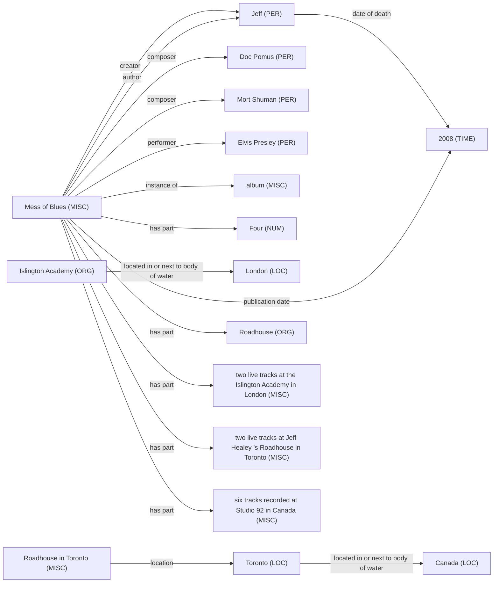
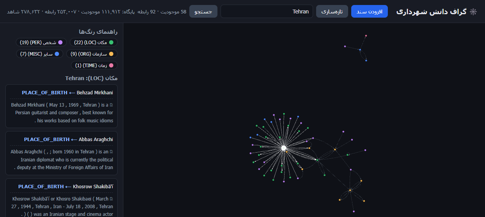

# ساخت خودکار گراف دانش از متن غیرساختاریافته با مدل‌های زبانی و هستان‌شناسی مقیّد

**نویسنده:** مصطفی رستگار
**دیتاست اصلی:** DocRED، پیکره‌ی کامل (انگلیسی، **۱۰۶٬۹۲۴ سند، ۱٬۵۵۶٬۰۹۳ سه‌تایی برچسب‌خورده**) به‌همراه برچسب‌های بازبینی‌شده‌ی Re-DocRED برای ۴٬۰۵۳ سند آن
**مطالعه‌ی موردی (فصل آخر):** اسناد شهرداری تهران (فارسی)

---

## چکیده

هدف این پروژه ساختن سامانه‌ای بود که از متن آزاد سه‌تایی‌های `(موجودیت، رابطه، موجودیت)` بیرون بکشد و آن‌ها را در گرافی قابل پرس‌وجو بنشاند. تفاوت چنین سامانه‌ای با یک فراخوانی ساده‌ی مدل زبانی در سه تصمیم است که از همان اول گرفتیم و تا آخر هم عوضشان نکردیم: هستان‌شناسی مقیّد که خروجی نامعتبر را دور می‌ریزد، الزام شاهد که هر یال را به جمله‌ی منبعش گره می‌زند، و خط لوله‌ای که هرچند بار هم اجرا شود داده‌ی تکراری نمی‌سازد.

سامانه را روی بنچمارک استاندارد Re-DocRED سنجیدیم. در شش تکرار پیاپی F1 از ۱۶٫۸۸ به ۲۹٫۶۶ رسید، یعنی ۷۶ درصد رشد نسبی، در حالی که خط‌مبنای منتشرشده با GPT-3.5 روی همین دیتاست ۹٫۷۴ است. هیچ مرحله‌ی آموزش گرادیانی در کار نبود، اما این را نباید با بی‌نظارت بودن اشتباه گرفت؛ هم هستان‌شناسی و هم مثال‌های داخل پرامپت از بخش Train مشتق شده‌اند و در بخش ۶٫۴ همین موضوع را باز کرده‌ایم. رشد از سه جا آمد: مثال کاری در پرامپت که دقت را ۲۴ درصد بالا برد، لایه‌ی بستار قاعده‌محور، و اجماع چند گذر مستقل.

بعد از آن سامانه را روی کل ۵۰۰ سند بخش Dev اجرا کردیم و F1 = ۲۸٫۶۴ گرفتیم. اختلافش با عدد زیرمجموعه کمتر از یک واحد بود، پس دست‌کم می‌شد مطمئن شد نتیجه به یک نمونه‌ی خوش‌شانس وابسته نیست.

مرحله‌ی سوم دیتاست را به پیکره‌ی کامل DocRED رساند: ۱۰۶٬۹۲۴ سند و ۱٫۵۶ میلیون سه‌تایی برچسب‌خورده، ۲۶ برابر بزرگ‌تر از مرحله‌ی پیش. این مقیاس ما را مجبور کرد استخراج را موازی کنیم (۴۸ درخواست هم‌زمان)، ازسرگیری بدون دوباره‌کاری را بسازیم، ارزیاب را جریانی کنیم و برای Neo4j بارگذار دسته‌ای بنویسیم. با gpt-4.1-mini روی ۹۹۸ سند بخش Dev عدد ۲۱٫۳۸ درآمد. بعد که مدل را به Sonnet عوض کردیم، قالب پاسخ را فشرده کردیم و به‌جای اجتماع دو گذر اشتراکشان را برداشتیم، همان ۹۹۸ سند به ۳۶٫۲۵ رسید و ۳٬۰۵۳ سند بخش Train برچسب‌خورده، که هیچ‌وقت در تنظیم پرامپت دخالت نداشت، ۳۶٫۳۳ گرفت. همان پیش‌بینی‌ها روی ۴۹۸ سند مشترک با برچسب اصلی دقت ۴۰٫۲۰ و با برچسب بازبینی‌شده‌ی Re-DocRED دقت ۶۶٫۴۲ می‌گیرند، و این تفاوت اندازه‌گیری مستقیم همان منفی‌های کاذبی است که مقاله‌ی Re-DocRED درباره‌شان هشدار داده. گراف نهایی از ۱۶٬۵۳۶ سند ساخته شد و ۱۱۱٬۹۱۲ موجودیت و ۲۵۳٬۰۰۷ رابطه دارد. در پایان همان سامانه، بدون اینکه معماری‌اش دست بخورد، روی اسناد فارسی شهرداری اجرا شد و فصل آخر به آن اختصاص دارد.

---

## ۱. مقدمه

بخش بزرگی از دانش هر سازمانی جایی ذخیره نشده که بشود از آن پرس‌وجو گرفت و در متن آزاد پراکنده است. برای پاسخ به پرسشی که در نگاه اول ساده می‌آید، مثلاً اینکه مجری فلان پروژه چه شرکتی بوده یا فلان شخص تابع کدام کشور است، باید ده‌ها سند را دستی خواند و کنار هم گذاشت.

گراف دانش راه‌حل شناخته‌شده‌ی این وضعیت است: متن به گره و یال تبدیل می‌شود و پرسش، به‌جای خواندن، با یک پرس‌وجو پاسخ می‌گیرد.

آنچه در این پروژه دنبال کردیم، استخراج رابطه در سطح سند (Document-level Relation Extraction) است. ورودی یک متن چندجمله‌ای است و خروجی مجموعه‌ای از سه‌تایی‌ها که هرکدام به جمله‌ی منبع خود گره خورده‌اند. دو چیز کار را سخت می‌کند.

اولی اینکه رابطه معمولاً در یک جمله جمع نشده و مدل باید چند جمله را دنبال کند و از زنجیره‌ی هم‌مرجعی رد شود. دومی که به نظر ما جدی‌تر است، این است که مدل زبانی رابطه‌ی نادرست می‌سازد. برای یک گراف دانش این خطا از خطای معمول بدتر است، چون یال غلط یک بار وارد می‌شود و بعد برای همیشه در پایگاه‌داده می‌ماند و به پرسش‌های بعدی هم سرایت می‌کند.

---

## ۲. کار پیشین

| رویکرد | نقطه‌ی قوت | نقطه‌ی ضعف |
|---|---|---|
| استخراج قاعده‌محور (Rule-based / OpenIE) | شفاف و بدون نیاز به داده | الگوی دستی، شکننده، پوشش کم، برای فارسی ضعیف |
| مدل‌های نظارت‌شده‌ی RE (ATLOP، KD-DocRE، GLiDRE) | دقت بالا روی بنچمارک | نیازمند هزاران سند برچسب‌خورده که در دامنه‌ی فارسی وجود ندارد |
| استخراج با مدل زبانی بزرگ (zero-shot) | بدون داده‌ی آموزشی کار می‌کند | مستعد تولید رابطه‌ی نادرست و خارج از دامنه |
| پایگاه‌داده‌ی گرافی (Neo4j) | بستر استاندارد ذخیره و پرس‌وجو | خودش استخراج نمی‌کند |

کار حاضر در دسته‌ی سوم است، ولی خطای آن را با یک لایه‌ی نمادین (symbolic) مهار می‌کند. این ترکیب در ادبیات **Neuro-symbolic Knowledge Graph Construction** نامیده می‌شود.

---

## ۳. نوآوری کار

ایده‌ی محوری این است که به مدل زبانی اعتماد نکنیم و خروجی‌اش را از چند صافی رد کنیم. پنج جزء زیر روی هم این کار را انجام می‌دهند.

**۳.۱ هستان‌شناسی مقیّد.** سه‌تایی تنها وقتی پذیرفته می‌شود که ترکیب `(نوع فاعل، رابطه، نوع مفعول)` آن در فهرست مجاز باشد؛ هر چیز دیگری بی‌چون‌وچرا کنار گذاشته می‌شود. این صافی در اجرای روی Re-DocRED یک‌پنجم خروجی مدل (۲۰٫۳٪) را رد کرد، و همان‌طور که در بخش ۶٫۴ نشان می‌دهیم، بهایی که بابتش پرداختیم تنها ۰٫۲۱٪ از بازخوانی بود.

**۳.۲ شاهد اجباری.** هر یال باید عین جمله‌ی منبع را با خود حمل کند و یال بی‌شاهد اصلاً وارد گراف نمی‌شود. حاصلش این است که هیچ ادعایی در گراف نمی‌ماند که نشود آن را تا متن اصلی دنبال کرد.

**۳.۳ لایه‌ی بستار قاعده‌محور.** مدل زبانی آنچه را می‌گوید که در جمله نوشته شده؛ اما گراف دانش باید آنچه را هم نگه دارد که از خودِ گراف نتیجه می‌شود. سه قاعده روی گراف اجرا می‌شوند و حقیقت‌های تازه می‌سازند. نکته‌ی طراحی اینجاست که هر حقیقت استنتاجی شاهد مقدمه‌هایش را به ارث می‌برد، پس قانون بند قبل زیر پا گذاشته نمی‌شود.

**۳.۴ خط لوله‌ی idempotent.** سند تازه اضافه کنید و دوباره اجرا کنید؛ نه سند تکراری ساخته می‌شود، نه قطعه، نه سه‌تایی، نه گره و نه یال. این را با کلید پایدار `entity_key` برای گره‌ها، `fact_id` مبتنی بر sha1 برای یال‌ها و کش در سطح `chunk_sha` به دست آوردیم.

**۳.۵ ورودی چندقالبی.** علاوه بر PDF و DOCX و TXT، تصویر (PNG/JPG) هم پذیرفته می‌شود و با مدل vision رونویسی می‌گردد.

---

## ۴. متدلوژی

### ۴.۱ معماری سه‌مرحله‌ای

| مرحله | ورودی ← خروجی | کار |
|---|---|---|
| **۱) ورود و پاک‌سازی** | سند خام ← قطعه‌ی متنی | استخراج متن، نرمال‌سازی (hazm برای فارسی)، قطعه‌بندی، ثبت `chunk_sha` |
| **۲) استخراج دانش** | قطعه ← سه‌تایی | فراخوانی مدل زبانی، اعتبارسنجی Pydantic، رد موارد خارج از هستان‌شناسی، الزام شاهد، حذف تکراری با `fact_id` |
| **۳) بستار و بارگذاری** | سه‌تایی ← گراف | اجرای سه قاعده‌ی استنتاج، سپس `MERGE` گره و یال در Neo4j |

### ۴.۲ هستان‌شناسی

هستان‌شناسی داخل کد نیست و از یک فایل JSON خوانده می‌شود (فلگ `--ontology`). وقتی این تصمیم را گرفتیم بیشتر به‌خاطر مرتب بودن کد بود، ولی بعداً معلوم شد همین باعث می‌شود بدون یک خط بازنویسی، همان کد روی دو دیتاست کاملاً متفاوت کار کند:

| دیتاست | منبع هستان‌شناسی | نوع موجودیت | رابطه | ترکیب مجاز |
|---|---|---:|---:|---:|
| شهرداری (فارسی) | دست‌نویس | ۶ | ۵ | ۵ |
| Re-DocRED (انگلیسی) | **خودکار از بخش Train** | ۶ | ۹۶ | **۶۵۴** |

برای Re-DocRED حتی یک قاعده هم دستی ننوشتیم؛ آن ۶۵۴ ترکیب مجاز را یک اسکریپت از روی داده‌ی آموزشی درآورد.

### ۴.۳ لایه‌ی بستار قاعده‌محور

| قاعده | منطق |
|---|---|
| **R1 معکوس** | `A در B واقع است` ⟹ `B شامل A است` |
| **R2 تراگذری** | `A در B` و `B در C` ⟹ `A در C` |
| **R3 زنجیره** | `A در B` و `B کشورش C` ⟹ `A کشورش C` |

### ۴.۴ پشته‌ی فناوری

Python، PyMuPDF و python-docx، hazm، دو مدل زبانی (`openai/gpt-4.1-mini` با دمای ۰ در مرحله‌ی ۱ و ۲، و مدل `sonnet` کلاد از راه Claude Code CLI در مرحله‌ی ۳)، Pydantic برای اعتبارسنجی، tenacity برای تلاش دوباره، Neo4j 5 روی Docker، و FastAPI به‌همراه vis-network برای رابط وب.

---

## ۵. دیتاست اصلی — پیکره‌ی کامل DocRED و برچسب‌های بازبینی‌شده‌ی Re-DocRED

**منبع DocRED:** https://github.com/thunlp/DocRED · نسخه‌ی Parquet: https://huggingface.co/datasets/thunlp/docred · **لایسنس:** MIT
**مقاله‌ی پایه:** Yao et al., *DocRED*, ACL 2019
**برچسب‌های بازبینی‌شده:** Tan et al., *Revisiting DocRED — Addressing the False Negative Problem*, EMNLP 2022 — https://github.com/tonytan48/Re-DocRED

کار روی این داده دو مرحله داشت. اول سراغ Re-DocRED رفتیم، یعنی همان ۴٬۰۵۳ سند برچسب‌خورده‌ی انسانی DocRED با برچسب‌هایی که بازبینی و کامل شده‌اند. بعد که استاد گفت این هم کوچک است، کل پیکره‌ی DocRED را برداشتیم؛ چیزی ۲۶ برابر بزرگ‌تر که بخش عمده‌اش را نه انسان، بلکه هم‌ترازی خودکار با Wikidata برچسب زده است.

### ۵.۰ جدول ۰ — پیکره‌ی کامل DocRED

این اعداد را با `python -m src.docred stats` از روی خود فایل‌های Parquet شمردیم و خروجی‌اش در `data/benchmark/docred/stats.json` مانده است، پس هر کدامشان قابل بازتولید است.

| بخش | نوع برچسب | سند | جمله | واژه | موجودیت | ذکر | سه‌تایی |
|---|---|---:|---:|---:|---:|---:|---:|
| train_annotated | انسانی | ۳٬۰۵۳ | ۲۴٬۲۵۶ | ۶۰۳٬۴۶۸ | ۵۹٬۴۹۳ | ۷۹٬۴۸۱ | ۳۸٬۱۸۰ |
| validation (dev) | انسانی | ۹۹۸ | ۸٬۰۵۷ | ۲۰۰٬۰۷۷ | ۱۹٬۵۲۸ | ۲۶٬۱۴۱ | ۱۲٬۲۷۵ |
| test | مخفی (لیدربرد) | ۱٬۰۰۰ | — | ۱۹۷٬۷۸۷ | ۱۹٬۵۳۹ | ۲۶٬۷۰۴ | — |
| train_distant | نظارت‌ازدور | ۱۰۱٬۸۷۳ | ۸۲۸٬۱۱۵ | ۲۰٬۳۲۸٬۸۵۸ | ۱٬۹۶۵٬۴۸۴ | ۲٬۵۵۸٬۳۵۰ | ۱٬۵۰۵٬۶۳۸ |
| **جمع** | | **۱۰۶٬۹۲۴** | | **۲۱٬۳۳۰٬۱۹۰** | **۲٬۰۶۴٬۰۴۴** | **۲٬۶۹۰٬۶۷۶** | **۱٬۵۵۶٬۰۹۳** |

| شاخص | مقدار |
|---|---:|
| جفت‌موجودیت نامزد | ۴۱٫۱ میلیون |
| نرخ مثبت | ۳٫۸٪ |
| سه‌تایی بین‌جمله‌ای (بخش نظارت‌ازدور) | ۸۶۷٬۶۳۴ (۵۷٫۶٪) |
| جفت‌موجودیت با بیش از یک رابطه | ۱۵۱٬۶۷۹ |
| حجم خام | ۳۸۰ مگابایت JSONL |

درباره‌ی برچسب‌ها دو چیز را باید همین‌جا روشن کرد. برچسب‌های اصلی DocRED ناقص‌اند و مقاله‌ی Re-DocRED نشان داده که بسیاری از رابطه‌های موجود در متن اصلاً برچسب نخورده‌اند؛ در بخش ۷٫۸ همین نقص را با یک مجموعه پیش‌بینی ثابت و دو مجموعه برچسب اندازه گرفته‌ایم. نکته‌ی دوم اینکه برچسب بخش نظارت‌ازدور کار انسان نیست و از هم‌ترازی خودکار با Wikidata می‌آید، برای همین آنچه روی آن بخش گزارش می‌کنیم «توافق با برچسب ازدور» است و نه F1 به معنای متعارفش.

### ۵.۱ جدول ۱ — ابعاد کلی برچسب‌های بازبینی‌شده (Re-DocRED)

این اعداد را هم از روی فایل‌های واقعی شمردیم و از مقاله نقل نکردیم.

| بخش | سند | جمله | توکن | موجودیت | ذکر (mention) | سه‌تایی |
|---|---:|---:|---:|---:|---:|---:|
| Train | ۳٬۰۵۳ | ۲۴٬۲۵۶ | ۶۰۳٬۴۶۸ | ۵۹٬۳۵۹ | ۷۹٬۴۸۱ | ۸۵٬۹۳۲ |
| Dev | ۵۰۰ | ۴٬۱۱۰ | ۱۰۱٬۹۷۰ | ۹٬۶۸۴ | ۱۳٬۱۸۹ | ۱۷٬۲۸۴ |
| Test | ۵۰۰ | ۳٬۹۶۶ | ۹۸٬۷۳۴ | ۹٬۷۷۹ | ۱۳٬۰۱۸ | ۱۷٬۴۴۸ |
| **جمع** | **۴٬۰۵۳** | **۳۲٬۳۳۲** | **۸۰۴٬۱۷۲** | **۷۸٬۸۲۲** | **۱۰۵٬۶۸۸** | **۱۲۰٬۶۶۴** |

| شاخص | مقدار |
|---|---:|
| نوع رابطه | ۹۶ |
| نوع موجودیت | ۶ |
| میانگین جمله در هر سند | ۸٫۰ |
| میانگین توکن در هر سند | ۱۹۸٫۴ |
| میانگین موجودیت در هر سند | ۱۹٫۴ |
| میانگین سه‌تایی در هر سند | ۲۹٫۸ |
| حجم خام | ۲۴ مگابایت JSON |

### ۵.۲ جدول ۲ — توزیع نوع موجودیت

| نوع | معنی | تعداد | سهم |
|---|---|---:|---:|
| LOC | مکان | ۲۳٬۱۷۴ | ۲۹٫۴٪ |
| TIME | زمان | ۱۵٬۱۴۰ | ۱۹٫۲٪ |
| MISC | سایر | ۱۲٬۴۵۹ | ۱۵٫۸٪ |
| PER | شخص | ۱۲٬۲۷۷ | ۱۵٫۶٪ |
| ORG | سازمان | ۱۰٬۷۳۵ | ۱۳٫۶٪ |
| NUM | عدد | ۵٬۰۳۷ | ۶٫۴٪ |
| **جمع** | | **۷۸٬۸۲۲** | **۱۰۰٪** |

### ۵.۳ جدول ۳ — ده رابطه‌ی پرتکرار (از ۹۶)

| رتبه | شناسه‌ی Wikidata | معنی | تعداد |
|---:|---|---|---:|
| ۱ | P131 | واقع در واحد تقسیمات کشوری | ۲۸٬۲۹۶ |
| ۲ | P17 | کشور | ۱۹٬۹۰۶ |
| ۳ | P27 | تابعیت | ۶٬۲۶۹ |
| ۴ | P150 | شامل واحد تقسیمات کشوری | ۴٬۷۶۴ |
| ۵ | P800 | اثر شاخص | ۴٬۲۵۷ |
| ۶ | P527 | دارای جزء | ۳٬۳۰۷ |
| ۷ | P361 | جزئی از | ۳٬۰۱۲ |
| ۸ | P175 | اجراکننده | ۲٬۳۸۶ |
| ۹ | P577 | تاریخ انتشار | ۲٬۲۵۸ |
| ۱۰ | P463 | عضو | ۱٬۸۷۷ |

### ۵.۴ جدول ۴ — ویژگی‌های هر رکورد (Schema)

| فیلد | سطح | نوع | توضیح |
|---|---|---|---|
| `title` | سند | متن | عنوان سند |
| `sents` | سند | آرایه‌ی آرایه | جمله‌های توکن‌شده |
| `vertexSet` | سند | آرایه | فهرست موجودیت‌ها |
| `vertexSet[i][j].name` | ذکر | متن | شکل ظاهری در متن |
| `vertexSet[i][j].type` | ذکر | برچسب | یکی از ۶ نوع |
| `vertexSet[i][j].sent_id` | ذکر | عدد | شماره‌ی جمله |
| `vertexSet[i][j].pos` | ذکر | بازه | موقعیت توکنی |
| `labels[k].h` | رابطه | اندیس | موجودیت مبدأ |
| `labels[k].t` | رابطه | اندیس | موجودیت مقصد |
| `labels[k].r` | رابطه | برچسب | یکی از ۹۶ رابطه |
| `labels[k].evidence` | رابطه | آرایه | شماره‌ی جمله‌های شاهد |

روی هم یازده ویژگی متمایز داریم: سه تا در سطح سند، چهار تا در سطح ذکر و چهار تا در سطح رابطه.

### ۵.۵ چرا این دیتاست چالشی است

**۵.۵.۱ استدلال چندجمله‌ای اجباری.**
۶۴٬۵۲۴ سه‌تایی، یعنی ۵۳٫۵ درصد کل رابطه‌ها، میان دو موجودیتی برقرار است که هیچ‌وقت در یک جمله کنار هم نیامده‌اند. ترجمه‌ی عملی‌اش این است که یک مدل جمله‌محور، هرقدر هم در سطح جمله خوب کار کند، روی بیش از نیمی از این داده صفر می‌گیرد.

**۵.۵.۲ نامتوازنی شدید کلاس.**
تعداد جفت‌موجودیت نامزد ۱٬۵۸۴٬۹۹۴ است و از این میان فقط ۱۲۰٬۶۶۴ جفت واقعاً رابطه دارند، یعنی نرخ مثبت ۷٫۶۱ درصد. به بیان دیگر مدل باید ۹۲٫۴ درصد موارد را درست رد کند، و این همان مسئله‌ی مهار توهم است که در بخش ۳ درباره‌اش حرف زدیم.

**۵.۵.۳ فضای برچسب بزرگ و دنباله‌دار.**
۹۶ رابطه وجود دارد، ولی ۵ رابطه‌ی نخست ۵۲٫۶٪ نمونه‌ها را می‌گیرند و ۷ رابطه کمتر از ۱۰۰ نمونه دارند.

**۵.۵.۴ چندبرچسبی بودن.**
۲۴٬۶۳۶ جفت‌موجودیت هم‌زمان بیش از یک رابطه دارند، پس ارزیابی ناچار باید چندبرچسبی باشد.

**۵.۵.۵ هم‌مرجعی و حل موجودیت.**
۱۰۵٬۶۸۸ ذکر به ۷۸٬۸۲۲ موجودیت نگاشت می‌شود و ۱۸٫۶٪ موجودیت‌ها بیش از یک ذکر دارند. «Willi Schneider» و «Schneider» باید به یک گره برسند.

**۵.۵.۶ مقیاس محاسباتی.**
با ۸۰۴٬۱۷۲ توکن و ۱٫۵۸ میلیون جفت نامزد، خط لوله دیگر نمی‌تواند یک اسکریپت ساده باشد؛ باید دسته‌ای کار کند، ازسرگیری‌پذیر باشد و کاری را که یک بار انجام شده دوباره انجام ندهد.

### ۵.۶ گزینه‌های فارسی که بررسی و رد شد

| دیتاست | اندازه | چرا انتخاب نشد |
|---|---|---|
| PERLEX | ۱۰٬۶۹۰ جمله، ۹ رابطه | سطح جمله است، نه سطح سند. استدلال چندجمله‌ای ندارد. |
| FarsBase-KBP | ۲۲٬۰۱۵ سه‌تایی فارسی | فایل داده به‌صورت عمومی در دسترس نیست. نیاز به مکاتبه با نویسندگان دارد. |
| ARMAN / PEYMA | فقط NER | رابطه ندارد، پس برای گراف دانش ناقص است. |

---

## ۶. آرایش آزمایش و معیارها

### ۶.۱ آرایش

همان آرایش استانداردی را نگه داشتیم که مقاله‌های این بنچمارک استفاده می‌کنند: فهرست موجودیت‌های هر سند به مدل داده می‌شود و مدل باید رابطه‌های بین آن‌ها را پیدا کند و برای هرکدام جمله‌ی شاهد را نقل کند.

| بخش سامانه | تغییر برای Re-DocRED |
|---|---|
| قطعه‌بندی و پیش‌پردازش | بدون تغییر |
| فراخوانی مدل زبانی | بدون تغییر |
| اعتبارسنجی Pydantic | بدون تغییر |
| شاهد اجباری | بدون تغییر |
| حذف تکراری با `fact_id` | بدون تغییر |
| **هستان‌شناسی** | **از فایل JSON خوانده می‌شود** |

### ۶.۲ معیارها

- **Precision / Recall / F1** روی مجموعه‌ی سه‌تایی‌های `(سند، موجودیت مبدأ، رابطه، موجودیت مقصد)`.
- **Ign F1** معیار سخت‌گیرانه‌ی DocRED. هر حقیقتی که در بخش Train هم دیده شده، از **هر دو طرف** (طلایی و پیش‌بینی) حذف می‌شود، تا حفظ‌کردن جواب امتیاز نگیرد.

### ۶.۳ اعتبارسنجی خودِ ارزیاب

قبل از اینکه به هیچ عددی اعتماد کنیم، اول خود ارزیاب را آزمایش کردیم. شش تست آفلاین داریم که نه به شبکه نیاز دارند و نه به مدل زبانی:

| تست | چه چیزی را ثابت می‌کند |
|---|---|
| اوراکل | پاسخ کامل درست باید ~۱۰۰ بگیرد |
| نصف بازخوانی | نصف پاسخ باید دقت ۱۰۰ و بازخوانی ~۵۰ بگیرد |
| موجودیت ناشناخته | نام نامعتبر باید حذف شود، نه اینکه امتیاز بگیرد |
| شکل ظاهری متفاوت | ذکر دیگرِ همان موجودیت باید به همان گره برسد |
| مجموعه‌ی Ign | مجموعه‌ی Ign باید کوچک‌تر از مجموعه‌ی کامل باشد |
| قاعده‌های بستار | R1، R2 و R3 باید فعال شوند و هر حقیقت استنتاجی شاهد داشته باشد |

یک نکته‌ی تست اوراکل را باید جدی گرفت: پاسخ کاملاً درست F1 برابر ۹۹٫۶۲ روی زیرمجموعه‌ی ۵۰ سند و ۹۹٫۷۶ روی کل ۵۰۰ سند Dev گرفت، نه ۱۰۰. علتش این است که در چند سند دو موجودیت متفاوت نام و نوع یکسان دارند و با نام از هم جدا نمی‌شوند. پس سقف هر سامانه‌ی نام‌محور روی این داده حدود ۹۹٫۷ است و هر عددی که پایین‌تر می‌آوریم باید کنار همین سقف خوانده شود.

### ۶.۴ سامانه دقیقاً از چه نظارتی استفاده می‌کند

این بخش را نوشتیم تا ادعای بزرگ‌تر از واقعیت نکنیم. سامانه هیچ مرحله‌ی آموزش گرادیانی ندارد و هیچ وزنی در آن به‌روز نمی‌شود، اما «بدون نظارت» خواندنش هم درست نیست، چون دو چیز از بخش Train گرفته‌ایم:

| چه چیزی از Train آمده | چگونه استفاده می‌شود | کدام نسخه‌ها |
|---|---|---|
| هستان‌شناسی: ۶۵۴ ترکیب مجاز `(نوع، رابطه، نوع)` | هر سه‌تایی بیرون این فهرست رد می‌شود | v1 تا v6 |
| دو سند نمونه با پاسخ کامل طلایی | داخل پرامپت به‌عنوان مثال کاری | v4 تا v6 |

این کار یک پیامد ناخوشایند دارد. چون هستان‌شناسی هر ترکیبی را که در Train دیده نشده ممنوع می‌کند، اگر ترکیبی فقط در Dev آمده باشد سامانه هیچ راهی برای پیش‌بینی‌اش ندارد. یعنی خودمان یک سقف روی بازخوانی گذاشته‌ایم.

برای اینکه بدانیم این سقف چقدر گران تمام می‌شود اندازه‌اش گرفتیم. از ۱۷٬۲۸۴ حقیقت طلایی بخش Dev فقط ۳۷ مورد، یعنی ۰٫۲۱ درصد، ترکیب نوعی دارند که در Train نیامده و فیلتر آن‌ها را ممنوع می‌کند؛ ۲۵ ترکیب متمایز، از جنس `MISC --league--> MISC`. پس سقف بازخوانی تحمیل‌شده ۹۹٫۷۹ درصد است.

معامله‌ای که این فیلتر پیشنهاد می‌کند روشن است: ۲۰٫۳ درصد خروجی مدل زبانی را می‌گیرد و در عوض ۰٫۲۱ درصد بازخوانی را می‌سوزاند. با این نسبت، نگه داشتنش تصمیم سختی نبود.

بنابراین اگر بخواهیم دقیق حرف بزنیم، v1 یعنی «zero-shot با هستان‌شناسی مشتق از Train» و v4 تا v6 یعنی «few-shot با دو مثال»؛ هیچ‌کدام بی‌نظارت نیستند. مقایسه‌ی مستقیم اینها با یک خط‌مبنای zero-shot خالص به سود ما تمام می‌شود و در بخش ۷٫۷ دوباره همین هشدار را تکرار کرده‌ایم.

### ۶.۵ تنظیم روی Dev، و چرا این یک محدودیت است

پرامپت‌ها در شش تکرار شکل گرفتند و هر تکرار روی همان بخش Dev سنجیده شد که عدد نهایی هم از آن گزارش می‌شود. تصمیم‌هایی مثل اینکه اجماع بین کدام گذرها باشد یا کدام سه قاعده بماند، بعد از دیدن نتیجه‌ی Dev گرفته شد و نه قبل از آن.

این یعنی عدد Dev کمی خوش‌بینانه است. راه درست، یک اجرای واحد روی Test با پیکربندی قفل‌شده است؛ برچسب بخش Test عمومی نیست، پس در مرحله‌ی سوم (بخش ۷٫۸٫۳) همین پیکربندی روی ۳٬۰۵۳ سند بخش Train برچسب‌خورده اجرا شد که در تنظیم پرامپت نقشی نداشت: F1 = ۳۶٫۳۳ در برابر ۳۶٫۲۵ روی Dev. اختلاف ناچیز است، پس بیش‌برازش روی Dev دیده نمی‌شود.

### ۶.۶ حساسیت به سخت‌گیری در تطبیق موجودیت

ارزیاب، پاسخ را با نام به موجودیت طلایی نگاشت می‌کند و در حالت پیش‌فرض حتی وقتی نوع پیش‌بینی‌شده با نوع طلایی نمی‌خواند باز هم تطبیق را می‌پذیرد. این از نگاشت مبتنی بر اندیس، که بنچمارک اصلی استفاده می‌کند، آسان‌گیرتر است و می‌تواند عدد را متورم کند.

برای اینکه این نگرانی در حد حدس نماند، به ارزیاب یک حالت سخت‌گیرانه اضافه کردیم (`--strict-types`) که هر پیش‌بینی با نوع نادرست را دور می‌ریزد:

| حالت تطبیق | پیش‌بینی پذیرفته | Precision | Recall | **F1** | Ign F1 |
|---|---:|---:|---:|---:|---:|
| پیش‌فرض (بازگشت به نام) | ۱۱٬۷۸۷ | ۳۵٫۳۲ | ۲۴٫۰۹ | **۲۸٫۶۴** | ۲۸٫۲۳ |
| سخت‌گیرانه (نوع باید بخواند) | ۱۱٬۶۶۱ | ۳۵٫۵۷ | ۲۴٫۰۰ | **۲۸٫۶۶** | ۲۸٫۲۶ |

اختلاف دو صدم واحد است، پس آسان‌گیری تطبیق عدد را متورم نکرده بود. جالب اینکه ۱۲۶ پیش‌بینی‌ای که در حالت سخت‌گیرانه حذف شدند بیشترشان به‌هرحال غلط بودند و برای همین دقت کمی بالا هم رفت.

### ۶.۷ مهندسی مقیاس برای ۱۰۷ هزار سند

اجرای ۵۰۰ سند به‌صورت تک‌نخی حدود هفت ساعت طول کشیده بود. با همان سرعت، پیکره‌ی کامل بیش از یک ماه وقت می‌خواست که عملاً یعنی نشدنی. چهار تغییر این وضع را عوض کرد و هر چهارتا را روی داده‌ی واقعی اندازه گرفتیم.

| جزء | پیش از این | اکنون | اندازه‌گیری |
|---|---|---|---|
| استخراج | یک درخواست در هر لحظه، ۱۳ ثانیه بر سند | ۴۸ درخواست هم‌زمان (`--workers`) | ۱۵۰ تا ۲۲۰ سند در دقیقه، صفر شکست در ۱٬۹۹۶ فراخوانی |
| ازسرگیری | سندِ بدون رابطه در خروجی ثبت نمی‌شد و در اجرای بعد دوباره پول می‌داد | فایل کناری `.empty` سندهای بی‌رابطه را هم کش می‌کند | هیچ فراخوانی تکراری در ازسرگیری |
| بستار و ارزیاب | کل فایل در حافظه | جریانی، سند به سند، با اندیس بایتی | فایل ۱٫۵ میلیون سطری بدون رشد حافظه؛ عدد ۵۰۰ سند عیناً بازتولید شد (۲۸٫۶۴) |
| بارگذار Neo4j | چهار پرس‌وجو برای هر رابطه | دسته‌های ۲٬۰۰۰ تایی با `UNWIND`، یک تراکنش بر دسته | ۱۲٬۴۳۷ رابطه در ۱۷٫۵ ثانیه؛ اجرای دوباره صفر گره تازه ساخت |

**هزینه، اندازه‌گیری‌شده نه تخمینی.** استخراج‌کننده مصرف توکن هر فراخوانی را از پاسخ سرویس می‌خواند و در فایل `.usage.json` کنار خروجی می‌نویسد. روی ۸۹۸ سند بخش Dev:

| گذر | توکن ورودی بر سند | از آن کش‌شده | توکن خروجی بر سند | زمان کل |
|---|---:|---:|---:|---:|
| A (بدون مثال) | ۱٬۱۱۵ | ۰ | ۱٬۲۲۰ | ۲۸۰ ثانیه |
| B (دو مثال) | ۸٬۵۰۴ | ۷٬۰۷۸ (۸۳٪) | ۱٬۴۶۷ | ۲۴۷ ثانیه |

مثال‌های پرامپت ورودی را هفت برابر می‌کنند، ولی چون پیشوند ثابت است ۸۳ درصدش از کش سرویس می‌آید و پول تازه‌ای نمی‌برد. چیزی که واقعاً هزینه می‌سازد توکن خروجی است، نه ورودی؛ هر رابطه با جمله‌ی شاهدش حدود ۴۰ توکن می‌شود. با قیمت فهرست مدل، گذر A حدود ۰٫۰۰۲۴ دلار و گذر B حدود ۰٫۰۰۳۷ دلار برای هر سند خرج برمی‌دارد، یعنی کل پیکره در گذر A حدود ۲۵۰ دلار.

---

## ۷. نتایج

**زیرمجموعه:** ۵۰ سند نخست بخش Dev · **۱٬۸۶۸ سه‌تایی طلایی** · **۸۵ رابطه‌ی متمایز** · مدل `openai/gpt-4.1-mini`، دما ۰

### ۷.۱ جدول ۵ — شش تکرار

| نسخه | توضیح | سه‌تایی خروجی | Precision | Recall | **F1** | Ign F1 |
|---|---|---:|---:|---:|---:|---:|
| v1 | پرامپت پایه: «فقط چیزی را بده که متن می‌گوید» | ۴۶۶ | ۴۲٫۲۷ | ۱۰٫۵۵ | ۱۶٫۸۸ | ۱۹٫۲۰ |
| v2 | پرامپت جامع: همه‌ی جفت‌ها + رابطه‌ی معکوس + استنتاج زنجیره‌ای | ۷۱۶ | ۳۶٫۴۵ | ۱۳٫۹۷ | ۲۰٫۲۰ | ۲۱٫۰۶ |
| v3 | v2 + لایه‌ی بستار قاعده‌محور | ۹۸۵ | ۳۴٫۱۱ | ۱۷٫۹۹ | ۲۳٫۵۵ | ۲۳٫۹۰ |
| v4 | v2 + دو مثال کاری در پرامپت (few-shot) | ۵۰۱ | **۴۵٫۱۱** | ۱۲٫۱۰ | ۱۹٫۰۸ | ۱۹٫۸۶ |
| v5 | v4 + لایه‌ی بستار قاعده‌محور | ۷۱۰ | **۴۵٫۳۵** | ۱۷٫۲۴ | ۲۴٫۹۸ | ۲۵٫۵۲ |
| **v6** | **اجماع سه گذر (v1+v2+v4) + لایه‌ی بستار** | ۱٬۵۳۱ | ۳۲٫۹۲ | **۲۶٫۹۸** | **۲۹٫۶۶** | **۲۹٫۳۵** |

چیزی که از این جدول یاد گرفتیم، برخلاف انتظار اولیه‌مان بود.

تصور ما این بود که گذاشتن مثال در پرامپت بازخوانی را بالا می‌برد، چون مدل بهتر می‌فهمد چه می‌خواهیم. اما مقایسه‌ی v2 با v4 عکس این را نشان داد: دقت از ۳۶٫۴۵ به ۴۵٫۱۱ رفت، یعنی ۲۴ درصد رشد نسبی، و در همان حال تعداد خروجی کمتر شد. وقتی نرخ رد شدن توسط فیلتر هستان‌شناسی را نگاه کردیم دلیلش روشن شد؛ این نرخ از ۲۰٫۳ به ۱۸٫۷ درصد افتاده بود، یعنی مدل از همان اول کمتر رابطه‌ی نامعتبر می‌ساخت.

لایه‌ی بستار هم روی هر دو پرامپت جواب داد، که خیالمان را راحت کرد: از v2 به v3 مقدار F1 را ۳٫۳۵ واحد و از v4 به v5 آن را ۵٫۹۰ واحد بالا برد. یعنی کارش وابسته به یک پرامپت خاص نبود.

بزرگ‌ترین جهش اما از جای دیگری آمد. سه گذر مستقل با پرامپت‌های متفاوت، مجموعه‌های متفاوتی از حقیقت‌ها پیدا می‌کنند و اجتماع ساده‌ی آن‌ها بازخوانی را از ۱۷٫۲۴ به ۲۶٫۹۸ و F1 را به ۲۹٫۶۶ رساند. برداشت ما از این عدد این است که گلوگاه سامانه هیچ‌وقت ندانستن مدل نبود، کم‌گویی‌اش در یک گذر واحد بود.

روی هم از v1 به v6 مقدار F1 هفتاد و شش درصد رشد نسبی داشت، از ۱۶٫۸۸ به ۲۹٫۶۶.

یک نکته‌ی دیگر هم در این جدول هست که به‌راحتی از چشم می‌افتد. Ign F1 که معیار سخت‌گیرانه‌ی DocRED است، در همه‌ی نسخه‌ها نزدیک F1 یا حتی بالاتر از آن مانده. این یعنی امتیازی که می‌گیریم از حافظه‌ی پیش‌آموخته‌ی مدل نمی‌آید و مدل واقعاً دارد متن سند را می‌خواند.

### ۷.۲ جدول ۶ — بازخوانی به تفکیک رابطه (ده رابطه‌ی پرتکرار)

| رابطه | تعداد طلایی | v1 | v2 | v3 | v4 | v5 | **v6** |
|---|---:|---:|---:|---:|---:|---:|---:|
| located in the administrative territorial entity | ۴۵۵ | ۹٫۹٪ | ۱۸٫۷٪ | ۲۶٫۶٪ | ۱۱٫۰٪ | ۱۹٫۸٪ | **۳۵٫۶٪** |
| country | ۳۵۱ | ۲٫۰٪ | ۳٫۷٪ | ۷٫۱٪ | ۹٫۷٪ | ۱۸٫۲٪ | **۲۴٫۲٪** |
| contains administrative territorial entity | ۱۱۵ | ۰٪ | ۶٫۱٪ | ۲۵٫۲٪ | ۲٫۶٪ | ۲۲٫۶٪ | **۳۳٫۹٪** |
| country of citizenship | ۹۰ | ۱۲٫۲٪ | ۲۱٫۱٪ | ۲۱٫۱٪ | ۲۲٫۲٪ | ۲۲٫۲٪ | **۳۰٫۰٪** |
| notable work | ۵۳ | ۱٫۹٪ | ۱٫۹٪ | ۱٫۹٪ | ۱٫۹٪ | ۱٫۹٪ | ۳٫۸٪ |
| part of | ۳۲ | ۳٫۱٪ | ۶٫۲٪ | ۱۵٫۶٪ | ۰٪ | ۹٫۴٪ | **۱۵٫۶٪** |
| performer | ۳۲ | ۹٫۴٪ | ۳٫۱٪ | ۳٫۱٪ | ۳٫۱٪ | ۳٫۱٪ | **۱۲٫۵٪** |
| has part | ۳۲ | ۹٫۴٪ | ۹٫۴٪ | ۱۵٫۶٪ | ۹٫۴٪ | ۹٫۴٪ | **۱۵٫۶٪** |
| country of origin | ۳۱ | ۰٪ | ۰٪ | ۰٪ | ۰٪ | ۰٪ | ۰٪ |
| member of | ۳۰ | ۵۳٫۳٪ | ۳۳٫۳٪ | ۳۳٫۳٪ | ۲۳٫۳٪ | ۲۳٫۳٪ | **۶۳٫۳٪** |

دو ردیف این جدول بیش از بقیه گویا هستند. رابطه‌ی `contains` معکوس `located in` است و مدل زبانی در v1 هرگز جهت معکوس را نمی‌داد، تا جایی که بازخوانی‌اش صفر بود؛ لایه‌ی قاعده همین را به ۳۳٫۹ درصد رساند. در مقابل `country of origin` در همه‌ی نسخه‌ها صفر ماند، چون مدل به‌جایش معمولاً `country` را برمی‌گرداند. این خطا سیستماتیک است و از نزدیکی دو برچسب می‌آید، پس هیچ قاعده‌ی نمادینی حلش نمی‌کند.

### ۷.۳ سهم لایه‌ی بستار قاعده‌محور

| قاعده | حقیقت تولیدشده در v3 | حقیقت تولیدشده در v6 |
|---|---:|---:|
| R1 معکوس | ۱۵۳ | ۲۲۸ |
| R2 تراگذری | ۱۰۴ | ۲۰۳ |
| R3 زنجیره | ۱۳ | ۵۸ |
| **جمع** | **۲۷۰** | **۴۸۹** |

در v3 از ۲۷۰ حقیقت استنتاجی، ۷۶ مورد در پاسخ طلایی هم آمده بود، یعنی دقت ۲۸٫۱ درصد. این از دقت خود مدل زبانی پایین‌تر است، پس لایه‌ی قاعده در عمل بازخوانی می‌خرد و بخشی از دقت را می‌فروشد. چون F1 کل در هر شش نسخه بالا رفت، این معامله را به سود خودمان دیدیم.

یک نکته‌ی طراحی را اینجا جدی گرفتیم: هر حقیقت استنتاجی شاهد مقدمه‌های خودش را به ارث می‌برد، وگرنه قانون «هر یال باید شاهد داشته باشد» همین‌جا می‌شکست. یک تست خودکار هم دقیقاً همین را بررسی می‌کند.

### ۷.۴ نمونه‌ی گراف تولیدشده (سند انگلیسی)

گراف زیر **خروجی خام** سامانه (نسخه v6) روی سند `redocred_dev_0002` است. این سند هر شش نوع موجودیت را دارد. گراف بدون ویرایش دستی آورده شده تا خطا هم دیده شود: یال `Islington Academy --located in or next to body of water--> London` غلط است و مدل به‌جای `location` این برچسب را انتخاب کرده است. این دقیقاً همان نوع خطایی است که در بخش ۸٫۳ شمارش شد.



### ۷.۵ همان پایگاه‌داده و همان رابط وب، برای گراف انگلیسی

کل خروجی ۵۰۰ سند در همان **Neo4j** و با همان بارگذار فاز ۱ بار شد. تنها تغییر، فلگ `--ontology` بود:

```bash
python -m src.load_neo4j data/benchmark/triplets_full.jsonl     --ontology configs/ontology_redocred.json
```

**نتیجه‌ی بارگذاری:**

| شاخص | مقدار |
|---|---:|
| رابطه‌ی بارگذاری‌شده | ۱۲٬۴۳۷ از ۱۲٬۴۵۳ |
| گره انگلیسی | ۵٬۹۴۸ |
| یال (بدون یال شاهد) | ۱۲٬۳۹۶ |
| نوع یال متمایز | ۹۷ |
| گره شهرداری در همان پایگاه‌داده | ۳۸ |

توزیع گره انگلیسی: LOC ۱٬۶۳۶ · PER ۱٬۲۲۸ · MISC ۱٬۲۲۳ · ORG ۱٬۱۶۸ · TIME ۶۷۲ · NUM ۲۱.

شانزده رابطه بارگذاری نشد و وقتی دنبالشان گشتیم معلوم شد همه از لایه‌ی بستار آمده‌اند و ترکیب نوعشان بیرون آن ۶۵۴ ترکیب مجاز بوده، چیزی شبیه `NUM --part of--> MISC`. پس فیلتر هستان‌شناسی فقط خروجی مدل زبانی را بازرسی نمی‌کند و حقیقت‌های استنتاجی هم از همان صافی رد می‌شوند؛ قاعده‌ی نمادین هم اجازه ندارد چیزی وارد گراف کند که هستان‌شناسی مجازش نمی‌داند.

**گراف انگلیسی در رابط وب پروژه:**


**متن شاهد انگلیسی — کلیک روی گره `Mess of Blues`:**


هر رابطه جمله‌ی منبع خودش را نشان می‌دهد؛ مثلاً `PUBLICATION_DATE 2008` به جمله‌ی «It was released in 2008 less than two weeks after his death…» وصل است. یعنی قانون شاهد در زبان دوم هم بدون نوشتن حتی یک خط کد تازه برقرار ماند.

رابط وب یک فیلتر سند گرفت (`?doc=<id>`)، چون پایگاه‌داده اکنون دو گراف را با هم نگه می‌دارد و کشیدن هم‌زمان همه‌ی گره‌ها خوانا نیست.

**یکتاسازی موجودیت در مقیاس ۵۰۰ سند.** بارگذار گره‌ها را با کلید پایدار `نوع:نام` ادغام می‌کند و نتیجه‌اش این شد:

| شاخص | مقدار |
|---|---:|
| جفت (موجودیت، سند) در خروجی | ۷٬۲۹۸ |
| گره یکتا پس از ادغام | **۵٬۹۴۸** |
| تکرار حذف‌شده | **۱٬۳۵۰** |
| گره‌ای که در بیش از یک سند آمده | ۴۵۸ (۷٫۷٪) |

پرتکرارترین گره‌ها `LOC:American` با حضور در ۵۸ سند و `LOC:France` با ۲۲ سند بودند. همان چیزی که در بخش ۵٫۵٫۵ ادعا کرده بودیم، اینجا در مقیاس واقعی قابل دیدن است.

همین‌جا باید یک ضعف واقعی را هم اعتراف کنیم. کلید گره، شکل ظاهری دقیق نام است، پس `United States` و `the United States` و `U.S.` سه گره جدا می‌سازند در حالی که یک کشورند. سامانه ذکرهای هم‌مرجع را درون یک سند یکی می‌کند ولی نام‌های مترادف را بین سندها نه. در دیتاست شهرداری این مشکل را با کلیدگذاری روی کد ثابت بودجه دور زده بودیم، اما آن راه‌حل به درد همان دامنه می‌خورد و به اسناد عمومی تعمیم پیدا نمی‌کند. راه درستش یک مرحله‌ی پیوند موجودیت به پایگاه دانشی مثل Wikidata است که در بخش ۱۱ به‌عنوان کار آینده آورده‌ایم.

دوازده سند از ۵۰۰ سند هم هیچ رابطه‌ای ندادند و اصلاً به گراف نرسیدند.

### ۷.۶ اجرای کامل روی هر ۵۰۰ سند بخش Dev

جدول‌های بالا همه روی زیرمجموعه‌ی ۵۰ سند بودند و این نگرانی را داشتیم که عدد به یک نمونه‌ی کوچک وابسته باشد. برای همین سامانه را روی کل ۵۰۰ سند بخش Dev اجرا کردیم: ۱۷٬۲۸۴ سه‌تایی طلایی، ۹۵ رابطه‌ی متمایز و ۱٬۰۰۰ فراخوانی مدل زبانی در دو گذر.

| نسخه | سه‌تایی خروجی | Precision | Recall | **F1** | Ign F1 |
|---|---:|---:|---:|---:|---:|
| گذر A — پرامپت جامع، بدون مثال | ۶٬۱۷۶ | ۳۶٫۸۴ | ۱۳٫۱۶ | ۱۹٫۳۹ | ۱۹٫۹۳ |
| گذر B — همان پرامپت، با دو مثال | ۵٬۱۰۹ | **۴۴٫۶۳** | ۱۳٫۱۹ | ۲۰٫۳۶ | ۲۰٫۵۳ |
| **اجماع A+B + لایه‌ی بستار** | ۱۱٬۷۸۷ | ۳۵٫۳۲ | **۲۴٫۰۹** | **۲۸٫۶۴** | **۲۸٫۲۳** |

هر سه چیزی که روی زیرمجموعه دیده بودیم، در مقیاس ده برابر هم تکرار شد:

| یافته | روی ۵۰ سند | روی ۵۰۰ سند |
|---|---|---|
| رشد دقت با مثال در پرامپت | ۳۶٫۴۵ ← ۴۵٫۱۱ (+۲۴٪) | ۳۶٫۸۴ ← ۴۴٫۶۳ (**+۲۱٪**) |
| رشد بازخوانی با اجماع و قاعده | ۱۲٫۱۰ ← ۲۶٫۹۸ | ۱۳٫۱۹ ← **۲۴٫۰۹** |
| F1 نهایی | ۲۹٫۲۰ (اجماع دو گذر) | **۲۸٫۶۴** (اجماع دو گذر) |

اختلاف F1 بین دو مقیاس ۰٫۵۶ واحد شد، که برای خیال راحت کافی بود: عدد زیرمجموعه اتفاقی نبوده.

لایه‌ی بستار روی ۵۰۰ سند **۳٬۲۵۱ حقیقت استنتاجی** ساخت: R1 معکوس ۱٬۸۰۷، R2 تراگذری ۱٬۰۷۳، R3 زنجیره ۳۷۱.

**بازخوانی به تفکیک رابطه، روی هر ۵۰۰ سند:**

| رابطه | تعداد طلایی | بازخوانی |
|---|---:|---:|
| located in the administrative territorial entity | ۳٬۸۴۶ | ۳۵٫۹٪ |
| country | ۲٬۷۳۹ | ۲۱٫۶٪ |
| country of citizenship | ۸۲۳ | ۲۵٫۳٪ |
| contains administrative territorial entity | ۶۶۲ | **۴۱٫۸٪** |
| notable work | ۶۰۴ | ۳٫۸٪ |
| has part | ۴۶۹ | ۱۳٫۶٪ |
| part of | ۴۴۴ | ۱۴٫۰٪ |
| performer | ۳۳۰ | ۳٫۹٪ |
| publication date | ۲۹۵ | ۳۵٫۹٪ |
| participant of | ۲۸۱ | ۱۴٫۲٪ |

بالاترین بازخوانی مال `contains` است با ۴۱٫۸ درصد، و این در حالی است که مدل زبانی به‌تنهایی تقریباً هیچ‌وقت این رابطه را نمی‌دهد. تمام این عدد را لایه‌ی قاعده‌ی نمادین ساخته است.

### ۷.۷ مقایسه با کارهای منتشرشده

| سامانه | آموزش | F1 روی Re-DocRED |
|---|---|---:|
| KD-DocRE | نظارت‌شده روی ۳٬۰۵۳ سند | ۸۱٫۰۴ |
| ATLOP | نظارت‌شده | ۷۹٫۴۶ |
| GLiDRE | نظارت‌شده | ۷۷٫۸۳ |
| GPT-3.5 + NLI (کار منتشرشده) | zero-shot | ۹٫۷۴ |
| سامانه‌ی ما (v3، ۵۰ سند) | بدون مثال، با هستان‌شناسی مشتق از Train | ۲۳٫۵۵ |
| سامانه‌ی ما (v6، ۵۰ سند) | دو مثال از Train + اجماع سه گذر | ۲۹٫۶۶ |
| **سامانه‌ی ما (کل ۵۰۰ سند Dev)** | **دو مثال از Train + اجماع دو گذر** | **۲۸٫۶۴** |
| **سامانه‌ی ما (۵۰۰ سند Test، مدل `sonnet`)** | **دو مثال از Train + اجماع دو گذر + قالب فشرده** | **۳۱٫۷۰** |

حرف اصلی این جدول این است که سامانه بدون هیچ مرحله‌ی آموزش گرادیانی و فقط با دو مثال در پرامپت، بیش از سه برابر خط‌مبنای منتشرشده امتیاز گرفته. فاصله‌اش با مدل‌های نظارت‌شده هنوز زیاد است، ولی این فاصله را انتظار داشتیم؛ آن مدل‌ها روی سه هزار سند برچسب‌خورده آموزش دیده‌اند.

دو چیز را هنگام خواندن این جدول باید در نظر گرفت. سطر GPT-3.5 واقعاً zero-shot است ولی سطرهای ما نیستند، پس مقایسه‌ی مستقیم به سود ما تمام می‌شود؛ سطر منصفانه برای چنین مقایسه‌ای v1 با F1 برابر ۱۶٫۸۸ است که آن هم هستان‌شناسی مشتق از Train دارد. نکته‌ی دوم اینکه سه سطر نخست ما روی بخش Dev است و فقط سطر آخر، یعنی ۳۱٫۷۰، روی همان بخش Test بازبینی‌شده‌ای است که مدل‌های نظارت‌شده روی آن گزارش شده‌اند.

**هشدار مقایسه:** این جدول مقایسه‌ی **مرتبه‌ی بزرگی** است، نه مقایسه‌ی نقطه‌به‌نقطه. مدل‌های نظارت‌شده روی ۳٬۰۵۳ سند برچسب‌خورده آموزش دیده‌اند و سامانه‌ی ما هیچ آموزش گرادیانی ندیده است.

### ۷.۸ مرحله‌ی سوم — پیکره‌ی کامل DocRED

تا اینجا همه‌ی آزمایش‌ها روی زیرمجموعه‌های کوچک بود. برای اجرای روی کل پیکره سه چیز را عوض کردیم و باقی پیکربندی را دست‌نخورده نگه داشتیم، یعنی همان هستان‌شناسی و همان دو مثال و همان سه قاعده، تا بشود اثر همین سه تغییر را جدا دید.

اول مدل زبانی عوض شد و به‌جای `openai/gpt-4.1-mini` از مدل `sonnet` کلاد استفاده کردیم، از راه Claude Code CLI و با `effort=low`. علتش هم فنی نبود؛ کلید پولی به سقف هزینه خورده بود. دوم، قالب پاسخ را فشرده کردیم: مدل به‌جای JSON کامل فقط شماره‌ی موجودیت و شماره‌ی جمله را برمی‌گرداند و متن شاهد را خودمان از سند درمی‌آوریم، که طول پاسخ را حدود چهار برابر کم می‌کند. سوم، در ترکیب دو گذر به‌جای اجتماع سراغ اشتراک رفتیم، یعنی فقط سه‌تایی‌هایی می‌مانند که هر دو گذر پیدا کرده باشند. این سومی تصمیم بحث‌برانگیزتری بود و پایین‌تر درباره‌اش توضیح می‌دهیم.

اثر این سه تغییر روی همان ۹۹۸ سند بخش Dev و همان برچسب‌ها:

| پیکربندی | **F1** | Ign F1 |
|---|---:|---:|
| `gpt-4.1-mini` + اجتماع دو گذر | ۲۱٫۳۸ | ۲۰٫۱۱ |
| **`sonnet` + قالب فشرده + اجماع دو گذر** | **۳۶٫۲۵** | **۳۶٫۸۳** |

ترتیب اجرا: بخش Dev (۹۹۸ سند)، بخش Test (۱٬۰۰۰ سند DocRED و ۵۰۰ سند Re-DocRED با برچسب بازبینی‌شده)، بخش Train برچسب‌خورده (۳٬۰۵۳ سند) و در پایان نمونه‌ای از بخش نظارت‌ازدور.

**۷.۸.۱ بخش Dev کامل، ۹۹۸ سند، برچسب‌های اصلی DocRED.** ۱۲٬۲۷۵ سه‌تایی طلایی، ۹۶ رابطه.

| نسخه | سه‌تایی خروجی | Precision | Recall | **F1** | Ign F1 |
|---|---:|---:|---:|---:|---:|
| گذر A — بدون مثال | ۱۳٬۷۶۹ | ۳۲٫۵۷ | ۳۶٫۵۳ | ۳۴٫۴۳ | ۳۴٫۵۰ |
| گذر B — دو مثال | ۱۶٬۷۴۱ | ۳۰٫۶۴ | **۴۱٫۷۹** | ۳۵٫۳۶ | ۳۴٫۴۱ |
| **اجماع A∩B + لایه‌ی بستار** | ۱۰٬۶۱۶ | **۳۹٫۰۸** | ۳۳٫۸۰ | **۳۶٫۲۵** | **۳۶٫۸۳** |

اینجا چیزی دیدیم که با مرحله‌ی قبل جور درنمی‌آمد. با مدل تازه، مثال دیگر دقت نمی‌خرد بلکه بازخوانی می‌خرد و آن را از ۳۶٫۵۳ به ۴۱٫۷۹ می‌رساند، و این اشتراک دو گذر است که دقت را از ۳۲٫۵۷ به ۳۹٫۰۸ می‌برد. گرفتن اشتراک خروجی را از ۱۶٬۷۴۱ به ۱۰٬۶۱۶ سه‌تایی آب می‌کند و اول فکر کردیم این حتماً به ضرر F1 تمام می‌شود، ولی نشد؛ سه‌تایی‌هایی که فقط یک گذر دیده بودشان بیشترشان غلط بودند.

**۷.۸.۲ همان پیش‌بینی، دو مجموعه برچسب.** ۴۹۸ سند از این ۹۹۸ سند، همان سندهای بخش Dev مرحله‌ی قبل‌اند (تطبیق با عنوان). پس می‌شود **یک مجموعه پیش‌بینی ثابت** را یک بار با برچسب‌های اصلی DocRED و یک بار با برچسب‌های بازبینی‌شده‌ی Re-DocRED سنجید:

| برچسب طلایی | سه‌تایی طلایی | Precision | Recall | **F1** | Ign F1 |
|---|---:|---:|---:|---:|---:|
| DocRED اصلی | ۶٬۱۴۱ | ۴۰٫۲۰ | ۳۳٫۷۲ | **۳۶٫۶۸** | ۳۷٫۲۲ |
| Re-DocRED بازبینی‌شده | **۱۷٬۱۸۳** | **۶۶٫۴۲** | ۱۹٫۹۲ | ۳۰٫۶۴ | ۳۱٫۶۶ |

برچسب‌های بازبینی‌شده ۲٫۸ برابر بیشترند و دقت همان پیش‌بینی‌ها را از ۴۰٫۲۰ به ۶۶٫۴۲ می‌رسانند. یعنی حدود ۴۰ درصد از آنچه روی برچسب اصلی «مثبت کاذب» شمرده می‌شد، در واقع رابطه‌هایی بوده که در متن هست و فقط کسی برچسبشان نزده. همان چیزی که مقاله‌ی Re-DocRED ادعا کرده، اینجا با سامانه‌ی خودمان مستقیماً اندازه گرفته شد. برای خواندن باقی جدول‌های این گزارش یک نتیجه‌ی عملی دارد: هر عدد دقتی که روی برچسب اصلی DocRED می‌بینید کران پایین است، نه عدد واقعی. بازخوانی برعکس رفتار می‌کند، چون مخرجش ۲٫۸ برابر بزرگ‌تر شده.

**۷.۸.۳ بخش‌های دیگر با همان پیکربندی قفل‌شده.**

| بخش | سند | سه‌تایی طلایی | سه‌تایی خروجی | Precision | Recall | **F1** |
|---|---:|---:|---:|---:|---:|---:|
| Dev (DocRED) | ۹۹۸ | ۱۲٬۲۷۵ | ۱۰٬۶۱۶ | ۳۹٫۰۸ | ۳۳٫۸۰ | **۳۶٫۲۵** |
| Train برچسب‌خورده (DocRED) | ۳٬۰۵۳ | ۳۸٬۱۸۰ | ۳۳٬۰۵۴ | ۳۹٫۱۴ | ۳۳٫۸۹ | **۳۶٫۳۳** |
| Test (Re-DocRED، برچسب بازبینی‌شده) | ۵۰۰ | ۱۷٬۴۴۸ | ۵٬۵۵۹ | **۶۵٫۶۱** | ۲۰٫۹۰ | ۳۱٫۷۰ |
| Test (DocRED) | ۱٬۰۰۰ | — | ۱۰٬۶۷۶ | — | — | — |

مهم‌ترین چیزی که از این جدول درآمد، سطر دوم است. عدد بخش Train برچسب‌خورده ۳۶٫۳۳ شد، تقریباً برابر ۳۶٫۲۵ بخش Dev، آن هم با اندازه‌ای سه برابر و بدون اینکه این بخش در تنظیم پرامپت نقشی داشته باشد. برای ما این یعنی سامانه روی Dev بیش‌برازش نشده، و نزدیک‌ترین چیزی است که بدون داشتن برچسب Test می‌شد به یک ارزیابی بی‌طرف رسید.

دو توضیح هم لازم است. برچسب‌های DocRED برای بخش Test عمومی نیستند، پس برای آن ۱٬۰۰۰ سند فقط تعداد سه‌تایی را گزارش کرده‌ایم و نه دقت را. Ign F1 هم برای بخش Train بی‌معنا می‌شود و صفر درمی‌آید، چون کلید «دیده‌شده در Train» از خود همان بخش ساخته می‌شود.

**۷.۸.۴ بخش نظارت‌ازدور — نمونه‌ی ۲۰ هزار سندی.** این بخش ۱۰۱٬۸۷۳ سند دارد و برچسبش ماشینی و نویزی است. یک نمونه‌ی تصادفی ۲۰٬۰۰۰ سندی با بذر ۴۲ برداشتیم و گذر A را رویش اجرا کردیم. اجرا روی ۱۰٬۹۸۵ سند پیش رفت و همان‌جا سهمیه‌ی هفتگی مدل تمام شد. چون خروجی در فایل کناری می‌ماند هیچ سندی دوباره خرج نمی‌شود، و به این نتیجه رسیدیم که همین تعداد برای نشان دادن مقیاس کافی است:

| نسخه | سه‌تایی خروجی | Precision | Recall | **F1** |
|---|---:|---:|---:|---:|
| گذر A — بدون مثال | ۱۵۶٬۱۳۷ | ۲۶٫۵۰ | ۲۵٫۷۷ | ۲۶٫۱۳ |
| گذر A + لایه‌ی بستار | ۱۹۲٬۹۳۴ | ۲۴٫۲۳ | ۲۹٫۱۲ | **۲۶٫۴۵** |

این اعداد را نباید دقت خواند؛ توافق‌اند. برچسب طلایی این بخش، یعنی ۱۶۰٬۵۵۵ سه‌تایی روی همین ۱۰٬۹۸۵ سند، خودش خروجی یک سامانه‌ی خودکار است و هر اختلافی می‌تواند خطای هر کدام از دو طرف باشد. پایین‌تر بودن این عدد نسبت به بخش Dev هم چیزی است که از قبل انتظارش را داشتیم.

لایه‌ی بستار در این مقیاس ۳۶٬۷۹۹ سه‌تایی تازه ساخت که ۲۶٬۵۳۱ تای آن از قاعده‌ی وارون، ۶٬۴۸۶ تا از تراگذری و ۳٬۷۸۲ تا از زنجیره‌ی کشور آمد. برایند کارش بازخوانی را ۳٫۴ واحد بالا برد و دقت را ۲٫۳ واحد پایین آورد، یعنی روی F1 سود کوچکی داشت: از ۲۶٫۱۳ به ۲۶٫۴۵.

**۷.۸.۵ هزینه و توان عملیاتی.** همه‌ی اجراها روی یک لپ‌تاپ با ۴ هسته‌ی فیزیکی و ۱۶ کارگر هم‌زمان انجام شد.

| اجرا | سند | فراخوان | توکن ورودی | توکن خروجی | توکن کش‌شده | زمان |
|---|---:|---:|---:|---:|---:|---:|
| چهار بخش برچسب‌خورده (دو گذر) | ۵٬۵۵۱ | ۱۱٬۱۹۰ | ۴۳٫۷ م | ۳٫۱ م | ۲۰٫۱ م | ۳٫۳ ساعت |
| نظارت‌ازدور (گذر A) | ۱۰٬۹۸۵ | ۱۰٬۲۸۷ | ۲۶٫۷ م | ۲٫۶ م | — | ۳٫۵ ساعت |

توان عملیاتی پایدار روی بخش نظارت‌ازدور ۴۹٫۳ سند در دقیقه بود. گلوگاه پردازنده است و نه حافظه، چون هر کارگر حدود ۱۷۰ مگابایت بیشتر نمی‌گیرد. کش پرامپت هم در گذر B کار خودش را کرد و ۲۰٫۱ میلیون توکن از ۴۳٫۷ میلیون توکن ورودی از کش آمد، چون مثال‌ها همیشه در ابتدای پرامپت و ثابت‌اند.

**۷.۸.۶ گراف در مقیاس تازه.** خروجی هر پنج بخش (جمعاً **۱۶٬۵۳۶ سند**) با بارگذار دسته‌ای در همان Neo4j بار شد. بارگذاری با MERGE انجام می‌شود، پس اجرای دوباره هیچ گره یا یال تکراری نمی‌سازد. سنگین‌ترین بخش، همان نظارت‌ازدور بود: **۱۹۲٬۹۱۲ رابطه در ۶۳ ثانیه** (حدود ۳٬۰۰۰ رابطه در ثانیه). پایگاه در پایان این اندازه را دارد:

| سنجه | مقدار |
|---|---:|
| گره‌ی موجودیت | ۱۱۱٬۹۱۲ |
| یال رابطه | ۲۵۳٬۰۰۷ |
| نوع رابطه‌ی متمایز | ۱۰۱ |
| گره‌ی شاهد | ۲۷۸٬۶۳۲ |

کشیدن ۲۵۳ هزار یال روی یک صفحه هیچ فایده‌ای ندارد، برای همین به رابط وب یک جست‌وجوی موجودیت اضافه کردیم: نام را می‌نویسید و همسایگی آن موجودیت با شاهد هر یال می‌آید. تصویر زیر همسایگی `Tehran` را نشان می‌دهد که ۵۸ موجودیت و ۹۲ رابطه دارد. پنل سمت راست جمله‌ی منبع هر رابطه را می‌آورد و سربرگ، اندازه‌ی کل پایگاه را.



---

## ۸. تحلیل خطا

**۸.۱ کار مؤثر فیلتر هستان‌شناسی.**
در اجرای v2 مدل زبانی ۹۴۸ سه‌تایی برگرداند و فیلتر نوع ۱۹۲ مورد، یعنی ۲۰٫۳ درصد، را رد کرد. پرتکرارترین چیزهایی که رد شدند اینها بودند:

| سه‌تایی ردشده | تعداد | ایراد |
|---|---:|---|
| `PER --performer--> MISC` | ۱۶ | جهت برعکس است. درست آن `MISC --performer--> PER` است. |
| `PER --end time--> TIME` | ۱۳ | این ترکیب نوع در هستان‌شناسی وجود ندارد. |
| `PER --location--> LOC` | ۹ | برای شخص، رابطه‌ی `location` تعریف نشده است. |
| `PER --author--> MISC` | ۸ | جهت برعکس است. |

**۸.۲ کم‌گویی، علت اصلی بازخوانی پایین.**
هر سند به‌طور میانگین ۳۷٫۴ رابطه‌ی طلایی دارد. مدل در نسخه‌ی v1 تنها ۹٫۳ رابطه برمی‌گرداند؛ این عدد در v3 به ۱۹٫۷ و در v6 به ۳۰٫۶ رسید. الگو روشن است: مدل جمله‌های صریح را می‌بیند و از کنار حقیقت‌هایی که باید از زنجیره‌ی هم‌مرجعی یا استنتاج بیرون کشیده شوند رد می‌شود. اجماع چند گذر و لایه‌ی قاعده این شکاف را باریک کردند، اما آن را نبستند.

**۸.۳ نوع خطای مثبت کاذب.**
از ۶۴۹ مثبت کاذب نسخه v3:

| نوع خطا | تعداد | سهم |
|---|---:|---:|
| جفت‌موجودیت رابطه دارد، ولی برچسب رابطه اشتباه است | ۱۲۸ | ۱۹٫۷٪ |
| جفت‌موجودیت در پاسخ طلایی هیچ رابطه‌ای ندارد | ۵۲۱ | ۸۰٫۳٪ |

یعنی حدود یک‌پنجم خطاها از انتخاب اشتباه یکی از آن ۹۶ برچسب می‌آید و نه از ساختن رابطه‌ای که اصلاً در متن نیست. این تفکیک برای ما مهم بود، چون نوع اول با هستان‌شناسی دقیق‌تر قابل کم شدن است.

**۸.۴ خطای نگاشت نام.**
در v6 نود سطر از ۱٬۶۴۵ سطر، یعنی ۵٫۵ درصد، به هیچ موجودیت طلایی نگاشت نشد، چون مدل نام را دقیقاً از فهرست کپی نکرده بود. همین نرخ در v3 برابر ۳٫۶ درصد بود، و درس کوچکش این است که اجماع چند گذر خطای نگاشت را هم مثل بقیه‌ی چیزها روی هم جمع می‌کند.

---

## ۸.۵ ممیزی مستقل ارزیاب

بعد از اینکه نتایج جمع شد، کد ارزیابی و تست‌ها را به یک مدل زبانی دیگر (`gpt-5.6`) دادیم و از آن خواستیم علیه ادعاهای این گزارش استدلال کند. یازده ایراد گرفت که چهارتایش وارد بود و هر چهار مورد را اصلاح کردیم:

| ایراد | وضعیت | نتیجه |
|---|---|---|
| کلید Ign F1 در بخش Train از اولین ذکر ساخته می‌شد، ولی در Dev از ذکرِ الفباییِ نخست. دو کلید ناهمخوان. | **درست بود، اصلاح شد** | همه‌ی شکل‌های ظاهری وارد کلید شدند. تعداد کلید Train از ۷۷٬۷۰۰ به **۱۱۰٬۲۶۵** رسید. Ign F1 حدود ۰٫۳ واحد جابه‌جا شد. |
| تطبیق نام، وقتی نوع نمی‌خواند، باز هم قبول می‌کرد و می‌توانست عدد را متورم کند. | **درست بود، اندازه‌گیری شد** | حالت `--strict-types` افزوده شد. اختلاف **۰٫۰۲ واحد** بود (بخش ۶٫۶). ادعا سالم ماند. |
| گزارش خود را «zero-shot» می‌نامید، در حالی که هستان‌شناسی و مثال‌ها از Train می‌آیند. | **درست بود، اصلاح شد** | واژه‌ها بازنویسی شد و بخش ۶٫۴ نوشته شد. |
| سه تست ادعای نامشان را ثابت نمی‌کردند. | **درست بود، اصلاح شد** | تست قاعده‌ها حالا تعداد فعال‌شدن را می‌شمارد، تست Ign حذف از هر دو استخر را می‌سنجد، و یک تست تازه برای برخورد نام‌های یکسان افزوده شد. |

یک ایراد را هم رد کردیم: ادعای نشت پاسخ طلایی از لایه‌ی بستار. آن لایه فقط پیش‌بینی‌ها را می‌خواند و هیچ‌جا فایل طلایی را باز نمی‌کند.

برایند این ممیزی این شد که هیچ‌کدام از اعداد F1 تغییر نکرد، فقط Ign F1 حدود ۰٫۳ واحد جابه‌جا شد و دو ادعای واژگانی تصحیح شد.

---

## ۹. محدودیت‌ها

۱. برچسب بخش Test در DocRED عمومی نیست، پس هیچ عدد دقتی روی آن ۱٬۰۰۰ سند نداریم. نزدیک‌ترین ارزیابی بی‌طرفی که توانستیم بسازیم، بخش Train برچسب‌خورده با ۳٬۰۵۳ سند و F1 = ۳۶٫۳۳ و بخش Test بازبینی‌شده‌ی Re-DocRED با ۵۰۰ سند و F1 = ۳۱٫۷۰ است (بخش ۷٫۸٫۳).
۲. برچسب‌های اصلی DocRED ناقص‌اند و دقت را کمتر از واقع نشان می‌دهند؛ روی همان ۴۹۸ سند، دقت با برچسب بازبینی‌شده از ۴۰٫۲۰ به ۶۶٫۴۲ می‌رسد (بخش ۷٫۸٫۲). برچسب بخش نظارت‌ازدور از این هم نویزی‌تر است و عددی که برایش گزارش کرده‌ایم «توافق» است، نه دقت.
۳. نگاشت پاسخ بر پایه‌ی نام موجودیت است و نه اندیس، و همین سقفی حدود ۹۹٫۷ روی کار می‌گذارد (بخش ۶٫۳ و ۶٫۶).
۴. پرامپت‌ها روی همان بخش Dev تنظیم شدند که عدد از آن گزارش می‌شود (بخش ۶٫۵).
۵. لایه‌ی قاعده فقط سه قاعده دارد، در حالی که قاعده‌های بیشتری را می‌شود به‌صورت خودکار از بخش Train بیرون کشید.
۶. سامانه به یک مدل زبانی تجاری وابسته است، پس نتیجه به نسخه‌ی مدل هم وابسته می‌ماند.

---

## ۱۰. فصل آخر — مطالعه‌ی موردی ایرانی: گراف دانش اسناد شهرداری

این فصل همان سامانه را بدون تغییر معماری روی داده‌ی فارسی اجرا می‌کند. چیزی که می‌خواستیم ببینیم این بود که آیا کاری که برای انگلیسی و دامنه‌ی عمومی ساخته شده، به یک زبان و دامنه‌ی دیگر منتقل می‌شود یا نه.

### ۱۰.۱ دیتاست

اسناد واقع‌نمای شهرداری تهران به زبان فارسی. دیتاست را عمداً به‌هم‌پیوسته طراحی کردیم، یعنی یک موجودیت مثل «پروژه‌ی بهسازی پل صدر» یا یک ردیف بودجه، در چند سند مختلف و با نقش‌های متفاوت ظاهر می‌شود.

| ویژگی | مقدار |
|---|---|
| تعداد سند منبع | ۷ |
| قالب ورودی | TXT، DOCX، PDF، PNG/JPG (تصویر با OCR) |
| نوع سند | قرارداد، گزارش پروژه، صورت‌جلسه‌ی نظارت، گزارش شکایت، تخصیص بودجه |
| حجم متن خام | ۸۱۱ کلمه |
| قطعه (chunk) | ۷ |
| سه‌تایی خام با شاهد | ۳۹ |
| گره یکتا | ۳۸ |
| یال یکتا پس از MERGE | ۳۲ |
| نوع موجودیت | ۶ |
| نوع رابطه | ۵ |

**هستان‌شناسی:** موجودیت‌ها = {پروژه، پیمانکار، مکان، مسئول، بودجه، شکایت}. رابطه‌ها = {پیمانکار→مجریِ→پروژه، پروژه→واقع‌در→مکان، مسئول→ناظرِ→پروژه، بودجه→تأمین‌مالیِ→پروژه، شکایت→درباره‌ی→پروژه/مکان}.

**توزیع موجودیت:** مکان ۱۲، شکایت ۶، پروژه ۵، پیمانکار ۵، ناظر ۵، بودجه ۵ — جمع ۳۸.

**توزیع رابطه (خام):** واقع‌در ۱۱، تأمین‌مالی ۱۰، ناظر ۷، شکایت‌درباره‌ی ۶، مجری ۵ — جمع ۳۹، که پس از MERGE به ۳۲ یال یکتا رسید.

### ۱۰.۲ نتیجه

**دقت:** کل گراف را با متن منبع مقایسه کردیم و تمام رابطه‌های استخراج‌شده مورد تأیید متن بودند، یعنی چیزی نزدیک صد درصد. هیچ رابطه‌ی جعلی یا خارج از هستان‌شناسی به گراف نرسید.

**یکتایی موجودیت:** با کلیدگذاری بودجه بر پایه‌ی کد ثابت، یک بودجه که در چند سند با نام‌های متفاوت آمده بود به یک گره‌ی واحد نگاشت شد.

**نمای گراف دانش تولیدشده:**


**نمونه‌ی ردیابی — کلیک روی یک گره، رابطه‌ها و جمله‌ی منبع را نشان می‌دهد:**


### ۱۰.۳ چرا دقت اینجا ~۱۰۰٪ است و روی Re-DocRED ۳۵٪؟

وسوسه‌انگیز است که این تفاوت را به حساب بهتر کار کردن مدل روی فارسی بگذاریم، اما هیچ شاهدی برای چنین ادعایی نداریم. سه توضیح ساده‌تر وجود دارد.

نخست، فضای برچسب اینجا پنج رابطه دارد و آنجا نود و شش تا. وقتی مدل باید از میان پنج گزینه یکی را بردارد، احتمال انتخاب غلط طبیعتاً بسیار کمتر است.

دوم، و مهم‌تر از همه، ارزیابی اینجا دستی بود نه مبتنی بر برچسب طلایی. ما فقط می‌توانیم بگوییم هرچه استخراج شد درست بود؛ اینکه چه چیزهایی از قلم افتاد را اصلاً نمی‌دانیم. به بیان دقیق‌تر، آنچه اندازه گرفتیم دقت بود و نه بازخوانی، و عدد ۱۰۰٪ فقط نیمی از تصویر است.

سوم، اسناد شهرداری کوتاه و صریح‌اند و رابطه‌ی بین‌جمله‌ای در آن‌ها کم است، حال آنکه در Re-DocRED بیش از نیمی از رابطه‌ها (۵۳٫۵٪) بین دو موجودیتی برقرارند که هرگز در یک جمله کنار هم نیامده‌اند.

همین مقایسه توضیح می‌دهد که چرا رفتن سراغ یک بنچمارک استاندارد ضروری بود: وقتی برچسب طلایی در کار نباشد، عدد دقت بیش از آنکه اطلاع بدهد، گمراه می‌کند.

### ۱۰.۴ جدول مقایسه‌ی دو دیتاست

| شاخص | شهرداری (مطالعه موردی) | Re-DocRED (مرحله‌ی ۱ و ۲) | DocRED کامل (مرحله‌ی ۳) |
|---|---:|---:|---:|
| تعداد سند | ۷ | ۴٬۰۵۳ | ۱۰۶٬۹۲۴ |
| تعداد واژه | ۸۱۱ | ۸۰۴٬۱۷۲ | ۲۱٬۳۳۰٬۱۹۰ |
| تعداد موجودیت | ۳۸ | ۷۸٬۸۲۲ | ۲٬۰۶۴٬۰۴۴ |
| تعداد سه‌تایی | ۳۹ | ۱۲۰٬۶۶۴ | ۱٬۵۵۶٬۰۹۳ |
| نوع رابطه | ۵ | ۹۶ | ۹۶ |
| برچسب طلایی | ندارد | انسانی، بازبینی‌شده | انسانی (۴٬۰۵۱ سند) + نظارت‌ازدور (۱۰۱٬۸۷۳ سند) |
| رابطه‌ی بین‌جمله‌ای | کم | ۵۳٫۵٪ | ۵۷٫۶٪ |
| زبان | فارسی | انگلیسی | انگلیسی |

### ۱۰.۵ نتیجه‌ی فصل

سامانه بدون اینکه معماری‌اش دست بخورد روی دو زبان، دو دامنه و دو هستان‌شناسی کار کرد که تعداد رابطه‌هایشان ۱۹ برابر با هم فرق دارد، و تنها چیزی که بین این دو اجرا عوض شد یک فایل JSON بود. درسی که از این فصل گرفتیم این است که جدا نگه داشتن هستان‌شناسی از کد، تصمیمی که اولش فقط به چشم مرتب‌کاری می‌آمد، همان چیزی بود که انتقال‌پذیری را ممکن کرد.

---

## ۱۱. نتیجه‌گیری و کار آینده

**نتیجه‌گیری.** حرف اصلی این کار یک جمله است: مدل زبانی به‌تنهایی برای ساخت گراف دانش کافی نیست. اما وقتی کنارش یک هستان‌شناسی مقیّد، الزام شاهد و یک لایه‌ی استنتاج نمادین بگذاریم، می‌شود از متن غیرساختاریافته گرافی ساخت که هم دقیق باشد و هم بتوان هر ادعایش را تا جمله‌ی منبع دنبال کرد، آن هم بدون داشتن حتی یک سند آموزشی برچسب‌خورده در آن دامنه.

روی بنچمارک استاندارد Re-DocRED، سامانه **بیش از سه برابر** خط‌مبنای منتشرشده امتیاز گرفت: ۲۹٫۶۶ روی زیرمجموعه و **۲۸٫۶۴ روی کل ۵۰۰ سند Dev**، در برابر ۹٫۷۴. این عدد از یک سامانه‌ی بدون آموزش گرادیانی می‌آید، نه از یک سامانه‌ی بی‌نظارت.

در مرحله‌ی سوم، با همان معماری و تنها با سه تغییر (مدل `sonnet`، قالب پاسخ فشرده و اجماع به‌جای اجتماع)، عدد روی ۹۹۸ سند بخش Dev به **۳۶٫۲۵** رسید و روی ۳٬۰۵۳ سند بخش Train برچسب‌خورده — که در تنظیم پرامپت نقشی نداشت — **۳۶٫۳۳** شد. گراف نهایی از ۱۶٬۵۳۶ سند ساخته شد: ۱۱۱٬۹۱۲ موجودیت، ۲۵۳٬۰۰۷ رابطه و ۲۷۸٬۶۳۲ گره‌ی شاهد.

چهار یافته‌ی کلیدی، که هر چهار مورد در مقیاس ده برابر هم تکرار شدند:

۱. فیلتر هستان‌شناسی واقعاً توهم را می‌گیرد. ۲۰٫۳ درصد از خروجی مدل رد شد و پرتکرارترین ایراد هم معکوس بودن جهت رابطه بود.
۲. مثال کاری در پرامپت دقت را می‌خرد و نه بازخوانی را. دقت ۲۴ درصد رشد نسبی کرد و نرخ رد شدن از ۲۰٫۳ به ۱۸٫۷ درصد رسید.
۳. گلوگاه بازخوانی است، نه دقت. مدل زبانی کم‌گوست و لایه‌ی قاعده‌ی نمادین و اجماع چند گذر با هم بازخوانی را از ۱۰٫۵۵ به ۲۶٫۹۸ رساندند.
۴. Ign F1 نزدیک یا بالاتر از F1 ماند، یعنی امتیاز از حفظ بودن دانش پیش‌آموخته‌ی مدل نمی‌آید و از خواندن متن سند می‌آید.

**کار آینده.**
۱. بازیابی مثال مشابه برای هر سند (retrieval-augmented few-shot) به‌جای مثال ثابت.
۲. استخراج خودکار قاعده‌های بیشتر از بخش Train، به‌جای سه قاعده‌ی دست‌نویس.
۳. رأی‌گیری وزن‌دار در اجماع با سه گذر یا بیشتر. اشتراک دو گذر در مرحله‌ی سوم آزموده شد و F1 را بالا برد (بخش ۷٫۸٫۱)؛ گام بعدی، وزن دادن به گذرها به‌جای رأی دوتایی است.
۴. پیوند موجودیت به یک پایگاه دانش (مانند Wikidata)، تا `U.S.` و `United States` به یک گره برسند.
۵. نگاشت بر پایه‌ی اندیس به‌جای نام، برای برداشتن سقف ۹۹٫۷.
۶. افزودن لایه‌ی پرسش‌وپاسخ طبیعی روی گراف (Graph-QA).

---

## پیوست الف — بازتولید نتیجه

```bash
# ۱) آماده‌سازی داده و هستان‌شناسی خودکار از بخش Train
python -m src.redocred prepare --split dev --limit 50

# ۲) ساخت مثال‌های پرامپت از بخش Train
python -m src.redocred fewshot --n 2

# ۳) گذر A — پرامپت جامع، بدون مثال
python -m src.extract data/benchmark/chunks_dev.jsonl \
    --out data/benchmark/triplets_dev_v2.jsonl \
    --ontology configs/ontology_redocred.json

# ۴) گذر B — همان پرامپت، با دو مثال کاری
python -m src.extract data/benchmark/chunks_dev.jsonl \
    --out data/benchmark/triplets_dev_v4.jsonl \
    --ontology configs/ontology_redocred.json \
    --fewshot configs/fewshot_redocred.json

# ۵) اجماع گذرها + لایه‌ی بستار قاعده‌محور
cat data/benchmark/triplets_dev_v1.jsonl \
    data/benchmark/triplets_dev_v2.jsonl \
    data/benchmark/triplets_dev_v4.jsonl > data/benchmark/_union.jsonl
python -m src.redocred closure data/benchmark/_union.jsonl \
    --out data/benchmark/triplets_dev_v6.jsonl

# ۶) ارزیابی
python -m src.redocred eval data/benchmark/triplets_dev_v6.jsonl \
    --gold data/benchmark/gold_dev50.jsonl \
    --report data/benchmark/eval_report_v6.json

# ۷) نمودار گراف یک سند و PDF گزارش
python -m src.redocred graph data/benchmark/triplets_dev_v6.jsonl \
    --doc redocred_dev_0002 --out docs/graph_redocred.md
python -m src.md2pdf docs/FINAL_REPORT.md

# ۸) بارگذاری گراف انگلیسی در همان Neo4j (نیازمند اجرای Docker)
python -m src.load_neo4j data/benchmark/triplets_dev_v6.jsonl \
    --ontology configs/ontology_redocred.json
```

بارگذار Neo4j هم مانند استخراج‌کننده، هستان‌شناسی را از فایل JSON می‌خواند. پس همان پایگاه‌داده و همان رابط وب، گراف انگلیسی را هم نشان می‌دهد. نام رابطه‌ی انگلیسی که فاصله دارد، به نوع یال Cypher تبدیل می‌شود؛ برای نمونه `located in the administrative territorial entity` به `LOCATED_IN_THE_ADMINISTRATIVE_TERRITORIAL_ENTITY`.

یا با یک فرمان:

```powershell
.\rebuild.ps1 -Benchmark -Pdf     # اجرای بنچمارک روی ۵۰ سند و ساخت PDF
.\rebuild.ps1 -Full               # اجرای کامل روی هر ۵۰۰ سند بخش Dev
.\rebuild.ps1 -DocRED -Workers 48 # پیکره‌ی کامل DocRED: چهار بخش، ۴۸ درخواست هم‌زمان
.\rebuild.ps1                     # ساخت گراف شهرداری در Neo4j
```

اجرای پیکره‌ی کامل، مرحله به مرحله:

```bash
# داده‌ی DocRED از HuggingFace (چهار فایل Parquet، ۱۰۶ مگابایت) در data/benchmark/docred/
python -m src.docred prepare          # چهار بخش → chunks_*.jsonl و gold_*.jsonl
python -m src.docred stats            # آمار پیکره → stats.json

# استخراج هم‌زمان و ازسرگیری‌پذیر؛ توکن مصرفی در .usage.json ثبت می‌شود
python -m src.extract data/benchmark/docred/chunks_validation.jsonl \
    --out data/benchmark/docred/triplets_validation_a.jsonl \
    --ontology configs/ontology_redocred.json --workers 48

# ارزیابی یک مجموعه پیش‌بینی با هر فایل طلایی
python -m src.redocred eval data/benchmark/docred/triplets_validation.jsonl \
    --gold data/benchmark/docred/gold_validation.jsonl \
    --report data/benchmark/docred/eval_report_validation.json

# بارگذاری دسته‌ای در Neo4j
python -m src.load_neo4j data/benchmark/docred/triplets_validation.jsonl \
    --ontology configs/ontology_redocred.json
```

هر دو گذر **ازسرگیری‌پذیر** هستند. اگر اجرا نیمه‌کاره بماند، همان فرمان کار را از همان‌جا ادامه می‌دهد: خروجی در فایل `.part` نوشته می‌شود و اجرای بعدی آن را هم می‌خواند.

تست‌های آفلاین (بدون شبکه و بدون مدل زبانی):

```bash
python -m tests.test_extract      # ۶ تست هستان‌شناسی و اعتبارسنجی
python -m tests.test_redocred     # ۶ تست ارزیاب و لایه‌ی قاعده
```

خروجی هر دو: `all passed`.

## پیوست ب — فایل‌های تولیدشده

| فایل | محتوا |
|---|---|
| `src/ingest.py` | ورود سند، OCR تصویر، نرمال‌سازی، قطعه‌بندی |
| `src/extract.py` | استخراج با مدل زبانی، اعتبارسنجی، فیلتر هستان‌شناسی، few-shot |
| `src/load_neo4j.py` | بارگذاری idempotent در Neo4j |
| `src/app.py` + `web/index.html` | رابط وب نمایش گراف |
| `src/redocred.py` | آماده‌سازی بنچمارک، ساخت مثال، بستار قاعده‌محور، ارزیاب، نمودار |
| `src/md2pdf.py` | تبدیل گزارش فارسی به PDF با Chromium |
| `rebuild.ps1` | اجرای کل خط لوله با یک فرمان |
| `configs/ontology_redocred.json` | ۹۶ رابطه و ۶۵۴ ترکیب مجاز |
| `configs/fewshot_redocred.json` | مثال‌های پرامپت، برگرفته از بخش Train |
| `data/benchmark/triplets_dev_v1..v6.jsonl` | خروجی هر شش نسخه روی زیرمجموعه |
| `data/benchmark/eval_report_v1..v6.json` | گزارش عددی هر شش نسخه، با بازخوانی به تفکیک رابطه |
| `data/benchmark/triplets_full.jsonl` | خروجی اجرای کامل روی ۵۰۰ سند |
| `data/benchmark/eval_report_full.json` | گزارش عددی اجرای کامل |
| `tests/test_extract.py`، `tests/test_redocred.py` | ۱۲ تست آفلاین |
| `docs/DATASET_PROPOSAL.md` | سند فاز ۱ برای استاد |
| `docs/PHASE2_RESULTS.md` | گزارش تفصیلی فاز ۲ |
| `docs/graph_redocred.md` | نمودار گراف یک سند انگلیسی |
| `src/docred.py` | خواندن چهار بخش Parquet پیکره‌ی DocRED، ساخت chunk و gold، آمار پیکره |
| `data/benchmark/docred/stats.json`، `stats_detail.json` | آمار محاسبه‌شده‌ی پیکره‌ی کامل |
| `data/benchmark/docred/eval_report_validation*.json` | گزارش عددی بخش Dev کامل، هر گذر، و مقایسه‌ی دو مجموعه برچسب |
| `data/benchmark/docred/*.usage.json` | توکن مصرفی و زمان هر گذر، خوانده‌شده از پاسخ سرویس |
