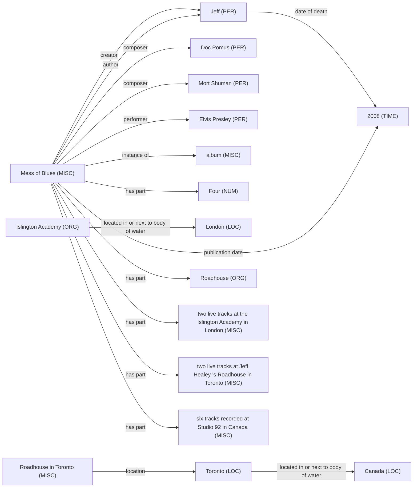

```mermaid
graph LR
  n0["Mess of Blues (MISC)"] -->|author| n1["Jeff (PER)"]
  n0["Mess of Blues (MISC)"] -->|publication date| n2["2008 (TIME)"]
  n0["Mess of Blues (MISC)"] -->|composer| n3["Doc Pomus (PER)"]
  n0["Mess of Blues (MISC)"] -->|composer| n4["Mort Shuman (PER)"]
  n0["Mess of Blues (MISC)"] -->|performer| n5["Elvis Presley (PER)"]
  n0["Mess of Blues (MISC)"] -->|instance of| n6["album (MISC)"]
  n1["Jeff (PER)"] -->|date of death| n2["2008 (TIME)"]
  n0["Mess of Blues (MISC)"] -->|has part| n7["Four (NUM)"]
  n8["Islington Academy (ORG)"] -->|located in or next to body of water| n9["London (LOC)"]
  n10["Roadhouse in Toronto (MISC)"] -->|location| n11["Toronto (LOC)"]
  n11["Toronto (LOC)"] -->|located in or next to body of water| n12["Canada (LOC)"]
  n0["Mess of Blues (MISC)"] -->|has part| n13["Roadhouse (ORG)"]
  n0["Mess of Blues (MISC)"] -->|creator| n1["Jeff (PER)"]
  n0["Mess of Blues (MISC)"] -->|has part| n14["two live tracks at the Islington Academy in London (MISC)"]
  n0["Mess of Blues (MISC)"] -->|has part| n15["two live tracks at Jeff Healey 's Roadhouse in Toronto (MISC)"]
  n0["Mess of Blues (MISC)"] -->|has part| n16["six tracks recorded at Studio 92 in Canada (MISC)"]
```